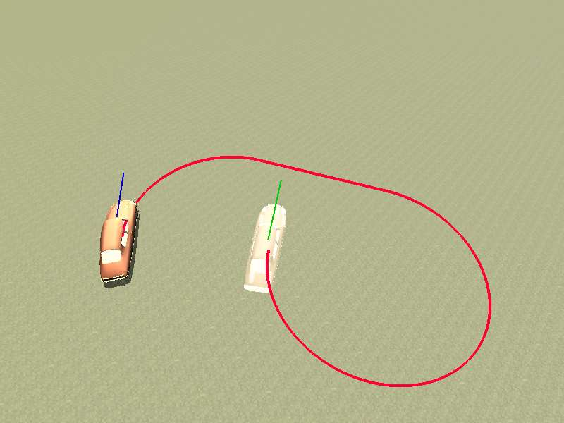
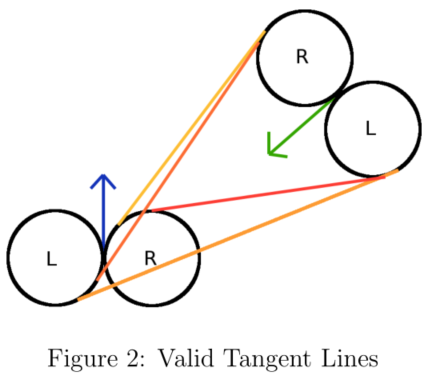
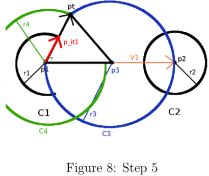

# A Comprehensive, Step-by-Step Tutorial on Computing Dubin’s Curves

author: Andy Giese

data: 2021/10/01

[TOC]

## 介绍

想象你有一个点，一张纸上的一个小点。从纸上的那个点到另一个点最快的方法是什么？你叹了口气，回答“直线”，因为它很明显;连一年级的学生都知道这一点。现在让我们想象你有一个开放的停车场，有一个人站在里面。人从停车场的一边到另一边最快的方式是什么?答案对你来说再明显不过了，所以你有点生气，半喊了一声:“又是一条直线，废话!”好了，好了，别再问这些问题了。

现在如果我给你一辆停在停车场的车然后问你那辆车进入停车位的最快方式是什么? 嗯，现在有点难了。你不能说直线，因为如果车不是直接面对停车位呢? 汽车不能仅水平滑行然后原地转弯，所以对它们进行规划似乎比人类要困难得多。但是!如果我们认为汽车是一种特殊类型的汽车，我们就可以像人类一样简单地为汽车制定计划，我们称之为Dubins汽车。想知道怎么做吗? 然后继续读下去!

在机器人技术中，我们可以把上述例子中的人类看作是一种完整的主体。不要被这个术语吓倒;我会解释的。一个完整的主体可以被简单地认为是一个我们可以完全控制的主体。也就是说，如果我们把人看做x-y平面上的一点，我们就可以从任意坐标移动到任意坐标。人类可以在极小的空间里转动，向前直走、侧步走、向后走等。他们在自己的坐标上可以完全控制自己。

然而，汽车不是完整的，因为我们不能在任何时候完全控制它。因此我们称汽车为一种非完整主体。汽车只能在一个最小半径的圆周内旋转，因此它们不能直接朝一个点移动，即使是在它们的左边或右边。你可以想象，为非完整主体规划路径比为完整主体规划路径要困难得多。

> 完整主体，就是完全能控制的，可以任意移动的，比如一个人，一个点。
>
> 非完整主体，是不能完全控制的，移动受到限制的，比如汽车。

让我们简化汽车的模型。这样怎么样:它只能向前移动，不能向后移动，而且它总是以单位速度移动，所以我们不需要担心刹车或加速。我刚才描述的被称为Dubins小车，为它规划最短路径是机器人和控制理论中一个被深入研究的问题。Dubins汽车吸引人的地方在于，它的最短路径可以用相对简单的几何图形精确地求解，而其他许多动力系统的规划则需要一些相当高水平和复杂的矩阵操作。

Dubins车是由著名的数学家和统计学家Lester Dubins 在1957年发表的一篇论文中引入的。这款车基本上只有3种控制方式:“最大限度左转”、“最大限度右转”和“直行”。Dubins车划出的所有路径都是这三个控制方式的组合。让我们命名这些控制方式: **“最大限度左转”为L，“最大限度右转”为R，“直走”为S**。我们可以让事情变得更一般:**左转弯和右转弯**都描述曲线，所以我们把它们归为一个类别，我们称之**为C(“曲线”)**。Lester Dubins在他的论文中证明了这些控制**只有6种组合可以描述所有的最短路径**，它们是: **RSR、LSL、RSL、LSR、RLR和LRL**。使用更通用的术语，只有两个类: **CSC和CCC**。

尽管已经有了相当好的研究，有了各种各样的几何证明以及关于最短路径的定性描述，我在互联网上找不到一个详细描述如何计算这些最短路径的资源！我们知道汽车可以向左拐一段时间，然后直走，然后右走，我想知道我需要拐多远，需要拐多长时间。如果你至少和我一样，你可能会忘记你在高中学过的一些几何知识，所以做这些计算对你来说并不像其他网上资源说的那么“琐碎”。

如果你在寻找计算这些最短路径所需的实际计算，那么你就找到了正确的地方。下面将是我迄今为止最长的一篇文章，基本上是关于如何计算Dubin最短路径所需的几何图形的指南。

## Overview

我们先讨论一下系统的动力学，然后描述一下最短路径的一般情况。之后，我将深入研究实际的计算。

类似汽车的机器人都有一个共同点——它们都有最小的转弯半径。把这个最小转弯半径想象成汽车旁边的一个圆，不管它怎么努力，机器人只能绕着圆周运动，前提是它要竭尽全力地转弯。这个圆的半径，$r_{min}$ 是汽车的最小转弯半径。这个半径是由汽车的物理特性决定的，物理特性为轮胎可以偏离的最大角度，以及轴距或从前轴到后轴的长度。Marco Monster有一篇非常好的描述文章，谈论这些汽车动力学。

## Car Dynamics

我已经提到过Dubins车只能以单位速度前进，我说的“前进”是指它不能换挡倒车。让我们更正式地描述车辆动力学。一个车辆的配置可以一组$(x,y,\theta)$​ 描述。定义汽车的速度为 $v$​ 。当汽车以半径为 $r_{min}$​ 做圆周运动时，就会有角速度：
$$
w=\frac{v}{r_{turn}}
$$
现在让我们定义系统是如何随时间发展的。如果你知道微分方程的基本知识，这对你来说就很容易了。如果不知道，我会解释的。当我们想描述系统如何随时间变化时，我们用 $\dot{x}$ 来表示 $x$ 坐标如何随时间变化。在基础向量数学中，如果我们的车在位置 $A=(x_1,y_1),\theta=\theta_1$ , 并且我们向前移动一个时间步长。则我们新的状态为 $B=(x_1+v*cos(\theta1)，y_1+v*sin(\theta_1),\theta_1)$, 我们可以说 $\dot{x}=cos(\theta)$​。完整的系统描述如下：
$$
\dot{x}=cos(\theta) \\
\dot{y}=sin(\theta) \\
\dot{\theta}=w=\frac{v}{r_{turn}}
$$
我想指出的是，这个方程是线性的，因为汽车的新位置与之前的位置是直线变化的。实际上，情况并非如此，汽车是非线性系统。因此，我上面描述的动力学仅仅是真实系统动力学的近似值。线性系统更容易处理，如果我们做得好，它们可以很好地近似真实的动力学，以至于很接近于真实的车辆。

动力学方程很好地转化为更新方程。这些更新方程描述了每次您想要更新汽车配置时实际发生的情况。也就是说，如果你正在通过模拟器，在每个时间步，你会想要更新汽车。由于Dubin的车只有单位速度，我们将所有v的实例都替换为1。

$$
x_{new}=x_{prev}+\delta*cos(\theta) \\
y_{new}=y_{prew}+\delta*sin(\theta)  \\
\theta_{new}=\theta_{prev}+\frac{\delta}{r_{turn}}
$$
注意，我实际上用 $\sigma$ 代替了 $v$. 是什么呢? 还记得我说过动力学是非线性系统的线性近似吗?每次更新时，我们都沿着一条线移动汽车。如果我们只在这条线上移动很短的一段时间，那么我们可以更精确地近似转弯。可以这样想:您正在尝试使用一系列均匀间隔的点来画一个圆。如果只用3个点，就得到一个三角形。用4得到正方形，用8得到八边形。随着你添加越来越多的点，你会得到一个更像圆的东西。这是相同的概念。δ告诉我们点之间的距离。如果它非常小，那么这些点就很接近，我们得到的整体运动看起来更接近现实。

## High-level Description of Dubin's curves

在这一节中，我将简要介绍6条轨迹(RSR、LSR、RSL、LSR、RLR、LRL)的样子。(免责声明:我不声称自己是一个艺术家，因此，你看到我在以下部分所画的图片不是成比例的;它们用来说明所有正在讨论的几何学。)

### CSC Trajectories

CSC轨迹包括RSR、LSR、RSL和LSR——一个转弯，接着是一条直线，然后是另一个转弯(如图1所示)。

为你的开始和目标设定一个位置和方向。画你的开始和目标配置为点在平面上箭头延伸的汽车正面对的方向。接下来，在车的左边和右边画圆圈，半径为 $r_{min}$​. 这个圆圈应该与汽车所在的位置相切。从开始位置的圆到目标位置的圆圈相切。在下一节中，我将讨论如何计算它，但现在只画出它们。

对于每一对圆(RR)、(LL)、(RL)、(LR)，应该有四条可能的切线，但请注意，每一对只有一条有效的线(如图2所示)。也就是说，对于RR圆，从代理圆延伸出的只有一条线符合目标圆，这样一切都朝着正确的方向进行。因此，对于任何CSC轨迹，都有一条独特的切线跟随。这条切线构成了轨迹的S部分。直线与圆相切的点就是代理完成其轨迹所必须经过的点。因此，求解这些轨迹基本上归结于正确计算这些切线。

## CCC Trajectories

CCC轨迹略有不同。它们包括一个方向的转弯，接着一个反方向的转弯，然后在原来的方向上再转一个，如图3所示的RLR轨迹。它们只在agent和它的目标相对接近时有效，否则一个圆的半径需要大于 $r_{min}$ （不是固定r的吗？？？），如果我们必须这样做，那么CCC轨迹是次优的。

对于Dubins 汽车，只有2条CCC轨迹：RLR 和 LRL.计算RR圆和LL圆之间的切线这次对我们没有帮助。我们转向的第三个圆仍然与agent和目标圆相切，但这些切点与切线计算中的切点不同。因此，要求解这些轨迹，就必须正确地计算出这三个切线圆的位置。

## Tangent Line Construction

在这一节中，我将讨论构造两个圆之间的切线的几何学。首先，我将讨论如何从几何上做到这一点，然后我将展示如何以一种更有效的、基于向量的方式来做到这一点。

已知：两个圆$C1和C2，半径分别为r1和r2$. 

考虑 $C_1$ 的中心为 $p1=(x_1,y_1)$, $C_2$ 的中心为 $p_2=(x_2,y_2)$，以此类推（图4）。

### Method 1: Geometrically computing tangents Inner tangents 几何计算切线

#### Inner tangents 内切线

1. 首先画一个从 $p_1$ 到 $p_2$ 的向量 $\vec{V_1}$, $\vec{V_1}=(x_2-x_1,y_2-y_1)$​. 这个矢量的大小是：

$$
D=\sqrt{(x_2-x_1)^2+(y_2-y_1)^2}
$$

2. 画一个以 $\vec{V_1}$中点为圆心，半径 $r_3=\frac{D}{2}$ 的圆 (图5)，也就是说：

$$
p_3=(\frac{x_1+x_2}{2},\frac{y_1+y_2}{2})
$$

3. 构建以 $C_1$ 为中心，半径为 $r_4=r_1+r_2$（图6）.

4. 构造一个从 $p_1$ 到 “top"点的向量 $\vec{V_2}$, “top"点 $p_t=(x_t,y_t)$ 是 $C_3$ 和 $C_4$ 的相交点。如果我们可以计算这个向量，那么我们就可以得到第一个切点，因为 $\vec{V_2}$ 除了指向 $p_t$​ 还指向这个切点（**切点？？？哪个切点？？？**）(图7).

5. 这是通过绘制一个从 $p_1$到 $p_2$到 $p_t$的三角形完成的，如图8。线段 $\overline{p_1p_3}$ 和 $\overline{p_3 p_t}$ 的长度 $r_4=\frac{D}{2}$。线段 $\overline{p_1 p_t}$ 的长度为 $r_3=r_1+r_2$. 我们感兴趣的是角度 $\gamma=\angle{p_t p_1 p_3}$ .

$\gamma$ 会给我们向量 $\vec{V_1}$ 需要旋转的角度，使其与向量 $\vec{V_2}=(p_t-p_1)$ 的方向一致, 通过方程下面的方程，我们得到了 $\vec{V_2}$ 绕 $x$ 轴旋转的全部旋转量 $\theta$。
$$
\theta=\gamma+atan2(\vec{V_1})
$$

> $\gamma=\angle{p_t p_1 p_3}$ . 已知了三角形 $p_t p_1 p_3$的各个边的长度，可以求出这个角度 $\gamma$。
>
> $atan2(\vec{V_1})$ 是 $\vec{V_1}$ 和 $x$ 轴的夹角
>
> $\theta$ 则是 $\vec{V_2}=\vec{p_t p_1}$ 和  $x$ 轴的夹角

（注意：atan2()函数首先取y分量，然后取x分量），$p_t$ 点坐标因此通过沿着向量 $\vec{V_2}$ 走 $r_4=r_1+r_2$​ 的距离得到 :
$$
x_t=x_1+(r_1+r_2)*cos(\theta)  \\
y_t=y_1+(r_1+r_2)*sin(\theta)
$$

6. 为了求出 $C_1$上的第一个内切点 $p_{it1}$，我们采用与求 $p_t$ 相似的方法 --- 从 $p_1$ 开始沿 $\vec{V_2}$ 移动，但只走 $r_1$ 的距离。 因为我们知道了$p_t$，所以我们可以计算 $\vec{V_2}=(p_t-p_1)$. 现在，我们需要正则化 $\vec{V_2}$ 然后乘以 $r_1$ 来得到从 $p_1$ 到 $p_{it1}$ 的向量 $\vec{V_3}$. （记住，要正则化一个向量，你需要将每个元素除以向量的大小 --> $\vec{V_3}=\frac{\vec{V_2}}{||\vec{V_2}||}*r_1$）. $p_{it1}$ 遵循简单的：

$$
p_{it1}=p_1+\vec{V_3}  \quad 感觉这个表达有点奇怪，但是表达的意思能明白
$$

把一个向量加到一个点上可能有点滥用符号，但是当我们把这个点的分量加到向量的分量上时，我们得到了新的点，一切都算出来了。

7. 现在我们有了 $p_t$ ,我们可以像图9一样画一个从 $p_t$ 到 $p_2$ 的向量 $\vec{V_4}$ . 注意，这个向量平行于 $C_1$ 和 $C_2$ 之间的内切线。

$$
\vec{V_4}=(p_2-p_t)
$$

我们可以利用它的大小和方向在 $C_2$ 上找到一个内切点。已知我们已经计算了 $p_{it1}$, 得到在 $C_2$ 的相关切点， $p_{it2}$ 很简单。
$$
p_{it2}=p_{it1}+\vec{V_4}
$$
我希望这足够清楚，让你们能够计算出另一个内切点。技巧是使用 $C_3$ 和 $C_4$ 之间的 ”底部“ 交点，然后完全相同地计算出 $p_{it3}$ 和 $p_{it4}$, 它们定义了另一条内切线。

#### Outer tangents 外切线

构造外切线和构造内切线非常相似。已知相同地两个圆 $C_1$ 和 $C_2$ ,并假设 $r_1 \geq r_2$. 还记得一开始我们让 $C_4$ 以 $p_1$ 为中心，半径为 $r_4=r_1+r_2$ 吗？这一次，我们将用不同的方法构造它。$C_4$ 和之前一样，以 $p_1$ 为中心，但这次它的半径为 $r_4=r_1-r_2$​.

按照我们对内切点执行的步骤，在 $V_1$ 的中点上构造与之前完全相同的 $C_3$.  找到 $C_3$ 和 $C_4$ 的交点，得到的 $p_t$ 和以前一样。当我们像以前一样完成了所有的步骤直到我们得到 $\vec{V_2}$, 我们可以得到第一个外切点 $p_{ot1}$ ，就像之前一样，沿着 $\vec{V_2}$ 走 $r_1$ 的距离。我只是想指出在正则化前 $\vec{V_2}$ 的大小是 $r_4 < r_1$ 而不是 $r_4 > r_1$. 为了获得 $C_2$ 上伴随的切点 $p_{ot2}$, 我们执行加法
$$
p_{ot2}=p_{ot1}+\vec{V_4}
$$
这和之前一模一样。

本质上，计算外切线与计算内切线之间唯一不同的步骤是 $C_4$ 如何构造；其它步骤都保持不变。

### Method 2: A Vector-based Approach

我们现在从几何上理解了如何得到两个圆之间的切线，我将向您展示一种更有效的方法，使用不需要构造圆 $C_3$ 或 $C_4$ 的向量来实现这一点。我们没有完成前一节的示例，我们必须完成第7步，以便您能够对以下向量方法的工作原理有一些直观的认识。

1. 像前面一样画圆 $C_1$ 和 $C_2$ (图4)
2. 画出从 $p_1$ 到 $p_2$ 的向量 $\vec{V_1}$ . 它的长度还是 $D$
3. 在切点之间画一个向量 $\vec{V_2}$. 在这种情况下，更容易从外切点开始，我们将其称为 $p_{ot1}$ 和 $p_{ot2}$. 所以 $\vec{V_2}=p_{ot2}-p_{ot1}$
4. 画一个垂直于 $\vec{V_2}$ 的单位向量。我们称它为法向量 $\hat{n}$ . 图10描述了我们的设置。一般情况下，$C_1$ 和 $C_2$ 的半径是不相等的，但对我们来说是平等的。这种方法对两种情况都适用。
5. 我们来考虑以下这些向量之间的关系。
   * $\vec{V_2}$ 和 $\hat{n}$ 之间的点积是0，因为向量是垂直的。
   * 

