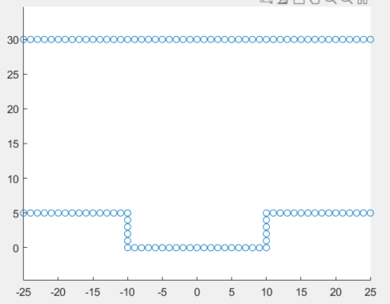
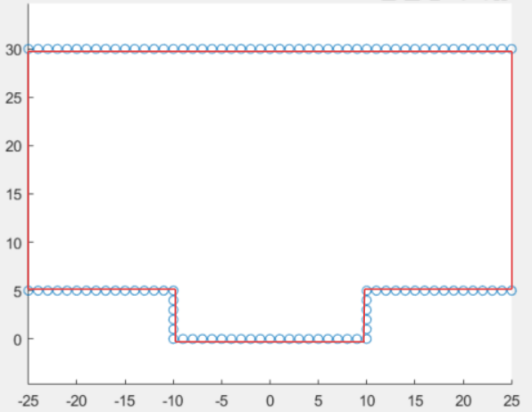
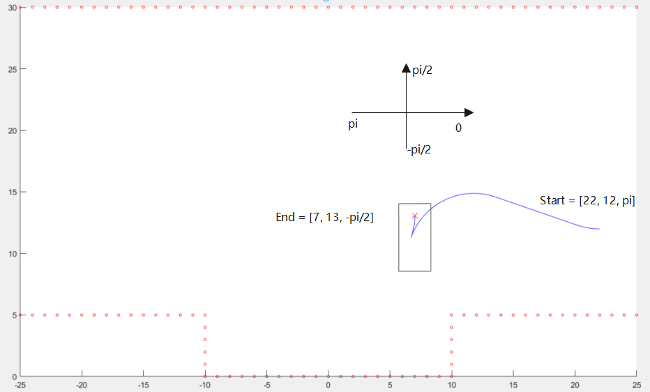

# Hybrid A star Code Analysis

## 1.1 构建环境


```matlab
ObstList = []; % Obstacle point list

for i = -25:25
    ObstList(end+1,:) = [i,30];
end
for i = -10:10
    ObstList(end+1,:) = [i, 0];
end
for i = -25:-10
    ObstList(end+1,:) = [i, 5];
end
for i = 10:25
    ObstList(end+1,:) = [i, 5];
end
for i = 0:5
    ObstList(end+1,:) = [10, i];
end
for i = 0:5
    ObstList(end+1,:) = [-10, i];
end
```

构建的场景为：



## 1.2 构建边界，用作做碰撞检测

```matlab
ObstLine = []; % Park lot line for collision check
tLine = [-25, 30 , 25, 30]; %start_x start_y end_x end_y
ObstLine(end+1,:) = tLine;
tLine = [-25, 5, -10, 5];
ObstLine(end+1,:) = tLine;
tLine = [-10, 5, -10, 0];
ObstLine(end+1,:) = tLine;
tLine = [-10, 0, 10, 0];
ObstLine(end+1,:) = tLine;
tLine = [10, 0, 10, 5];
ObstLine(end+1,:) = tLine;
tLine = [10, 5, 25, 5];
ObstLine(end+1,:) = tLine;
tLine = [-25, 5, -25, 30];
ObstLine(end+1,:) = tLine;
tLine = [25, 5, 25, 30];
ObstLine(end+1,:) = tLine;
```

构建结果：



## 1.3 配置车辆的基本几何参数

```matlab
Vehicle.WB = 3.7;  % [m] wheel base: rear to front steer
Vehicle.W = 2.6; % [m] width of vehicle
Vehicle.LF = 4.5; % [m] distance from rear to vehicle front end of vehicle
Vehicle.LB = 1.0; % [m] distance from rear to vehicle back end of vehicle
Vehicle.MAX_STEER = 0.6; % [rad] maximum steering angle 
Vehicle.MIN_CIRCLE = Vehicle.WB/tan(Vehicle.MAX_STEER); % [m] mininum steering circle radius
```

## 1.4 在Configure变量中配置相关配置参数

```matlab
% ObstList and ObstLine
Configure.ObstList = ObstList;
Configure.ObstLine = ObstLine;

% Motion resolution define
Configure.MOTION_RESOLUTION = 0.1; % [m] path interporate resolution
Configure.N_STEER = 20.0; % number of steer command
Configure.EXTEND_AREA = 0; % [m] map extend length
Configure.XY_GRID_RESOLUTION = 2.0; % [m]
Configure.YAW_GRID_RESOLUTION = deg2rad(15.0); % [rad]
% Grid bound
Configure.MINX = min(ObstList(:,1))-Configure.EXTEND_AREA;
Configure.MAXX = max(ObstList(:,1))+Configure.EXTEND_AREA;
Configure.MINY = min(ObstList(:,2))-Configure.EXTEND_AREA;
Configure.MAXY = max(ObstList(:,2))+Configure.EXTEND_AREA;
Configure.MINYAW = -pi;
Configure.MAXYAW = pi;
% Cost related define
Configure.SB_COST = 0; % switch back penalty cost,这个是什么意思？？？
Configure.BACK_COST = 1.5; % backward penalty cost，倒车的惩罚成本
Configure.STEER_CHANGE_COST = 1.5; % steer angle change penalty cost，方向盘角度变化的惩罚成本
Configure.STEER_COST = 1.5; % steer angle change penalty cost，这个和change的那个cost有什么区别？
Configure.H_COST = 10; % Heuristic cost，启发函数，怎么用？
```

## 1.5 设置起点和终点

```matlab
Start = [22, 12, pi];
End = [7, 13, -pi/2];
```

point=[x,y,heading_angle_rad]



## 1.6 用A*搜索的最短路径作为hybrid A star的启发值

参考链接：[A*寻路算法详解 #A星 #启发式搜索](https://www.bilibili.com/video/BV1bv411y79P/?spm_id_from=trigger_reload)

[astar算法伪代码--推荐](https://blog.csdn.net/epeaktop/article/details/21948235?spm=1001.2101.3001.6650.1&utm_medium=distribute.pc_relevant.none-task-blog-2%7Edefault%7ECTRLIST%7Edefault-1.no_search_link&depth_1-utm_source=distribute.pc_relevant.none-task-blog-2%7Edefault%7ECTRLIST%7Edefault-1.no_search_link)

### A*搜索伪代码(基于python)

```cpp
astar()
{
	//创建两个表，OPEN表保存所有已生成而未考察的节点，CLOSED表中记录已访问过的节点。　
	//算起点的估价值
	//将起点放入OPEN表
	while(OPEN!=NULL)　
	{　
		//从OPEN表中取估价值f最小的节点n　
		if(n节点==目标节点){　
			break;　
		}　
		for(当前节点n的每个子节点X)　
		{
			//算X的估价值　
			if(X in OPEN)
			{　
				if(X的估价值小于OPEN表的估价值)
				{　
					//把n设置为X的父亲　
					//更新OPEN表中的估价值//取最小路径的估价值　
				}
			}
			if(X in CLOSE)
			{　
				if(X的估价值小于CLOSE表的估价值)
				{
					//把n设置为X的父亲　
					//更新CLOSE表中的估价值　
					//把X节点放入OPEN//取最小路径的估价值　
				}　
			}
			if(X not in both)
			{　
				//把n设置为X的父亲
				//求X的估价值　
				//并将X插入OPEN表中//还没有排序　
			}
		}
		//将n节点插入CLOSE表中　
		//按照估价值将OPEN表中的节点排序//实际上是比较OPEN表内节点f的大小，从最小路径的节点向下进行。
	}
	//保存路径，即从终点开始，每个节点沿着父节点移动直至起点，这就是你的路径；
}
```


```matlab
ObstMap = GridAStar(Configure.ObstList,End,Configure.XY_GRID_RESOLUTION);
```

### GridAStar()

**函数功能**：使用完整约束有障碍情况下用A star搜索的最短路径作为hybrid A star的启发函数，这个怎么理解呢？

**函数路径**：

**函数解释**：

**问题**：

```matlab
function costmap = GridAStar(obstlist,goal,gres)
    [minx,miny,obmap] = CalcObstMap(obstlist,gres);
    col = goal(1);
    row = goal(2);
    col = ceil((col-minx)/gres);
    row = ceil((row-miny)/gres);
%     goal = [gx,gy];
%     goal.parent = [gx,gy];
%     goal.precost = 0;
%     goal.postcost = inf;
    goal = [row,col];
    costmap = 0*obmap; 
    dim = size(obmap);     
    for i = 1:dim(1)
        for j = 1:dim(2)
            if obmap(i,j) == 1
                costmap(i,j) = inf;
                continue
            elseif i == col && j == row
                continue
            end            
            start = [i,j];
            cost = AStarSearch(start,goal,obmap);
            costmap(i,j) = cost;
        end
    end    
end
```

### CalcObstMap()

**函数功能**：

**函数路径**：

**函数解释**：

**问题**：

```matlab
function [minx,miny,obmap] = CalcObstMap(obstlist,gres)
    minx = min(obstlist(:,1));
    maxx = max(obstlist(:,1));
    miny = min(obstlist(:,2));
    maxy = max(obstlist(:,2));
    xwidth = maxx - minx;
    xwidth = ceil(xwidth/gres);
    ywidth = maxy - miny;
    ywidth = ceil(ywidth/gres);
    obmap = zeros(ywidth,xwidth);
    for i = 1:ywidth
        for j = 1:xwidth
            ix = minx+(j-1/2)*gres;
            iy = miny+(i-1/2)*gres;
            [~,D] = knnsearch(obstlist,[ix,iy]);
            if D < 0.5
                obmap(i,j) = 1;
            end
        end
    end
end
```

> %cei,Y = ceil(X) 将 X 的每个元素四舍五入到大于或等于该元素的最接近整数。

> knnsearch(): [IDX,D] = knnsearch(X,Y), 为Y中的每个查询点查到X中最近的邻居，IDX为记录的行号，D为找到的点与其的距离，好像是类似kdtree的方式进行实现查找的。
>
> 参考链接：[matlab中的knnsearch函数](https://blog.csdn.net/qq_33596242/article/details/83689898)
>
> [knnsearch--Matlab官方文档](https://ww2.mathworks.cn/help/stats/knnsearch.html?searchHighlight=knnsearch&s_tid=srchtitle_knnsearch_1)

### AStarSearch()

**函数功能**：

**函数路径**：

**函数解释**：

**问题**：

```matlab
function cost = AStarSearch(start,goal,obmap)
    dim = size(obmap);
    % Grids(i,j,1) - x of parent pos; 2 - y of parent pos; 3 - precost; 4 -
    % postcost
    Grids = zeros(dim(1),dim(2),4);
    for i = 1:dim(1)
        for j = 1:dim(2)
            Grids(i,j,1) = i; % 父节点的所在行
            Grids(i,j,2) = j; % 父节点的所在列
            Grids(i,j,3) = norm(([i,j]-goal)); % 启发值h
            Grids(i,j,4) = inf; % g值
        end
    end
    Open = [start];
    Grids(start(1),start(2),4) = 0;
    Close = [];
    while ~isempty(Open)
        [wknode,Open] = PopOpen(Open,Grids);
        [Grids,Open,Close] = Update(wknode,goal,obmap,Grids,Open,Close);
        Close(end+1,:) = wknode;
    end
    cost = Grids(goal(1),goal(2),3)+Grids(goal(1),goal(2),4);
end
```

### PopOpen()

**函数功能**：找出open_list中cost最小的节点，并返回删除这个minidx的open_list

**函数路径**：

**函数解释**：

**问题**：

```matlab
function [wknode,Open] = PopOpen(Open,Grids)
    mincost = inf;
    minidx = 1;
    for i = 1:size(Open,1)
        node = Open(i,:);
        tcost = Grids(node(1),node(2),3)+Grids(node(1),node(2),4);
        if tcost < mincost
            minidx = i;
            mincost = tcost;
        end
    end
    wknode = Open(minidx,:);
    Open(minidx,:) = [];
end
```

### Update()

**函数功能**：搜索wknode节点周围可达节点，并计算g_cost，并更新到Grids中，对于不可到达的节点（wknode、超出地图范围的、障碍物边缘）都不计算g_cost，因为都不可到达。

g_cost的计算：欧式距离（wknode和周围可达节点的直线距离）

**函数路径**：

**函数解释**：

- wknode: OpenList中被弹出的cost最小的节点

- goal: 目标点

- obmap: 障碍物地图

- Grids: [parent_x,parent_y,h_cost,g_cost]

- Open: OpenList

- Close: CloseList,从OpenList中被弹出后会被放到CloseList中

**问题**：

```matlab
function [Grids,Open,Close] = Update(wknode,goal,obmap,Grids,Open,Close)
    dim = size(obmap);
    for i = -1:1
        for j = -1:1
            adjnode = wknode+[i,j];
            row = adjnode(1);
            col = adjnode(2);
            if i == 0 && j == 0
                continue
            elseif row < 1 || row > dim(1)
                continue
            elseif col < 1 || col > dim(2)
                continue
            elseif obmap(row,col) == 1
                continue
            end
            tcost = Grids(wknode(1),wknode(2),4)+norm([i,j]);
            if Grids(row,col,4) > tcost
                Grids(row,col,1) = wknode(1);
                Grids(row,col,2) = wknode(2);
                Grids(row,col,4) = tcost;
                % add adjnode to Open except wknode is goal
                if ~ismember(adjnode,Open,'rows') && ~isequal(adjnode,goal)
                    Open(end+1,:) = adjnode;
                end
                % if adjnode is in Close remove it
                if isempty(Close)
                    % do nothing
                elseif ismember(adjnode,Close,'rows')
                    [~,rIdx] = ismember(adjnode,Close,'rows');
                    Close(rIdx,:) = [];
                end
            end
        end
    end
end
```

> ismember():ismember(a,b) ,看矩阵a中的数是不是矩阵b中的成员
>
> [lia,lib]=ismember(a,c) ，lib是矩阵a中的数如果是矩阵b中的成员，则返回b的索引
>
> 参考链接：[MATLAB： ismember函数使用](https://blog.csdn.net/qq_27923041/article/details/74529685)

## 1.7 通过HybridAStar搜索路径

### HybridAStar()

**函数功能**：

**函数路径**：

**函数解释**：

- 若wknode在CloseList中，则用当前的wknode更新CloseList中原有的和wknode(x,y,theta)相同的node

**问题**：

```matlab
function [x,y,th,D,delta] = HybridAStar(Start,End,Vehicle,Configure)  
    veh = Vehicle;
    cfg = Configure;
    mres = cfg.MOTION_RESOLUTION; % motino resolution 
    
    % 把起始的位姿(x,y,theta)转换为grid上的栅格索引
    [isok,xidx,yidx,thidx] = CalcIdx(Start(1),Start(2),Start(3),cfg);
    if isok % 把位姿栅格定义为一个结点，形成链表结构
        tnode = Node(xidx,yidx,thidx,mres,0,Start(1),Start(2),Start(3),[xidx,yidx,thidx],0);
    end
    Open = [tnode]; % hybrid A*的Open集合
    Close = [];
%     [isok,xidx,yidx,thidx] = CalcIdx(End(1),End(2),End(3),cfg);
%     if isok
%         goal = Node(xidx,yidx,thidx,0,0,End,inf);
%     end
    x = [];
    y = [];
    th = [];
    D = [];
    delta = [];
    while ~isempty(Open)
        % pop the least cost node from open to close
        [wknode,Open] = PopNode(Open,cfg);
        [isok,idx] = inNodes(wknode,Close);
        
        % 判断是否在Close集合内
        if isok
            Close(idx) = wknode;
        else
            Close = [Close, wknode];
        end

        % 以wknode为根节点生成搜索树，使用Reeds-Shepp方法基于车辆单轨模型进行运动学解析拓展子结点
        [isok,path] = AnalysticExpantion([wknode.x,wknode.y,wknode.theta],End,veh,cfg);
        if  isok
            %把wknode从idx移到Close集合最后面
            Close(end+1) = wknode;
            Close(idx) = [];
            [x,y,th,D,delta] = getFinalPath(path,Close,veh,cfg);
            break % 如果能直接得到RS曲线，则跳出while循环
        end
        [Open,Close] = Update(wknode,Open,Close,veh,cfg); % 使用
    end
%     [isok,path] = AnalysticExpantion(Start,End,Vehicle,Configure);
end
```

### CalcIdx()

**函数功能**：把位姿(x,y,theta)转换为grid上的栅格索引,如果不符合实际则isok=false

**函数路径**：

**函数解释**：

输入参数：

- x = Start.x
- y = Start.y
- theta = Start.theta
- cfg，车辆配置和其他配置

输出参数：

- isok
- xidx
- yidx
- thidx

**问题**：

```matlab
% 把位姿(x,y,theta)转换为grid上的栅格索引,如果不符合实际则isok=false
function [isok,xidx,yidx,thidx] = CalcIdx(x,y,theta,cfg)
    gres = cfg.XY_GRID_RESOLUTION;
    yawres = cfg.YAW_GRID_RESOLUTION;
    xidx = ceil((x-cfg.MINX)/gres);
    yidx = ceil((y-cfg.MINY)/gres);
    theta = mod2pi(theta); % 控制theta范围在[-pi,pi]区间
    thidx = ceil((theta-cfg.MINYAW)/yawres);
    isok = true;
    if xidx <=0 || xidx > ceil((cfg.MAXX-cfg.MINX)/gres)
        isok = false;
        return
    elseif yidx <=0 || yidx > ceil((cfg.MAXY-cfg.MINY)/gres)
        isok = false;
        return
    end
    costmap = cfg.ObstMap;
    if costmap(yidx,xidx) == inf
        isok = false;
    end
end
```

### mod2pi()

**函数功能**：把弧度x控制在[-pi,pi]

**函数路径**：

**函数解释**：

**问题**：

```matlab
% 把弧度x控制在[-pi,pi]
function v = mod2pi(x)
    v = rem(x,2*pi); % 求整除x/2pi的余数
    if v < -pi
        v = v+2*pi;
    elseif v > pi
        v = v-2*pi;
    end
end
```

### Node::Node()

**函数功能**：包含Node节点所有的信息，自身的位置、航向角等，父节点的信息和节点cost

**函数路径**：

**函数解释**：

输入：

- D：cfg.MOTION_RESOLUTION

**问题**：

```matlab
classdef Node
    properties
        xidx = 0;
        yidx = 0;
        yawidx = 0;
        D = 0;
        delta = 0;
        x = 0;
        y = 0;
        theta = 0;
        parent = [0,0,0];
        cost = inf;
    end
    methods
        function obj = Node(xidx,yidx,yawidx,D,delta,x,y,theta,parent,cost) % 构造函数，声明的时候就定义了
            obj.xidx = xidx;
            obj.yidx = yidx;
            obj.yawidx = yawidx;
            obj.D = D;
            obj.delta = delta;
            obj.x = x;
            obj.y = y;
            obj.theta = theta;
            obj.parent = parent;
            obj.cost = cost;
        end
    end
end
```

### PopNode()

**函数功能**：从OpenList中找出cost最小的Node

**函数路径**：

**函数解释**：

**问题**：

```matlab
function [wknode,nodes] = PopNode(nodes,cfg)
    mincost = inf;
    minidx = 1;
    gres = cfg.XY_GRID_RESOLUTION;
    for idx = 1:length(nodes)
        tnode = nodes(idx);
        % x in the col y in row
        tcost = TotalCost(tnode,cfg);
        if tcost < mincost
            mincost = tcost;
            minidx = idx;
        end
    end
    wknode = nodes(minidx);
    nodes(minidx) = [];
end
```

### TotalCost()

**函数功能**：

**函数路径**：

**函数解释**：

**问题**：除了第一项h_cost，

g_cost没搞明白，，，算的是该wknode到他的栅格的中心的距离吗？？？

```matlab
function cost = TotalCost(wknode,cfg)
    gres = cfg.XY_GRID_RESOLUTION;
    costmap = cfg.ObstMap;
    % 从栅格中心到目标
    cost = cfg.H_COST*costmap(wknode.yidx,wknode.xidx); % 无障碍碰撞地图上的成本，用A*搜出来的，二维地图，没用航向
    % 从当前结点到栅格中心
    xshift = wknode.x - (gres*(wknode.xidx-0.5)+cfg.MINX); % 栅格的index是线的交点，而不是栅格的中心,在求坐标时所以会有减0.5
    yshift = wknode.y - (gres*(wknode.yidx-0.5)+cfg.MINY);
    cost = cost+cfg.H_COST*norm([xshift,yshift]);
    % f = g + h
    cost = wknode.cost + cost;
end
```

### inNodes()

**函数功能**：检查当前的wknode是否在CloseList中

**函数路径**：

**函数解释**：

输入：

- node: wknode
- nodes: Close

**问题**：

```matlab
function [isok,idx] = inNodes(node,nodes)
    for i = 1:length(nodes)
        tnode = nodes(i);
        if node.xidx == tnode.xidx...
                && node.yidx == tnode.yidx...
                && node.yawidx == tnode.yawidx
            idx = i;
            isok = true;
            return
        end
    end
    idx = 1;
    isok = false;
end
```

### AnalysticExpantion()

**函数功能**：以wknode为根节点生成搜索树，使用Reeds-Shepp方法基于车辆单轨模型进行运动学解析拓展子结点

**函数路径**：

**函数解释**：

[isok,path] = AnalysticExpantion([wknode.x,wknode.y,wknode.theta],End,veh,cfg);

**问题**：

```matlab
function [isok,path] = AnalysticExpantion(Start,End,Vehicle,Configure)
    isok = true;
    isCollision = false;
    
    % 将起点转换到原点计算轨迹，变换坐标系了
    pvec = End-Start;
    x = pvec(1);
    y = pvec(2);
    phi = Start(3);
    phi = mod2pi(phi);
    dcm = angle2dcm(phi, 0, 0); % 起点start坐标系在基坐标系下的方向余弦矩阵
    % dcm*x 表示将基坐标中的x表示到旋转后的坐标系中，即计算坐标旋转后各向量在新坐标中的表示
    tvec = dcm * [x; y ; 0]; % 计算坐标旋转后各向量在起点start坐标中的表示
    x = tvec(1);
    y = tvec(2);
    veh = Vehicle;
    cfg = Configure;
    rmin = veh.MIN_CIRCLE;
    smax = veh.MAX_STEER;
    mres = cfg.MOTION_RESOLUTION;
    obstline = cfg.ObstLine;
    
    % 看是否从当前点到目标点存在无碰撞的Reeds-Shepp轨迹，前面pvec=End-Start;的意义就在这里，注意！这里的x,y,prev(3)是把起点转换成以start为原点坐标系下的坐标
    path = FindRSPath(x,y,pvec(3),veh);

    % 以下是根据路径点和车辆运动学模型计算位置，检测是否会产生碰撞，返回isok的值。对每段路径从起点到终点按顺序进行处理，这一个线段的终点pvec是下一个线段的起点px,py,pth，  
    types = path.type;
    t = rmin*path.t;
    u = rmin*path.u;
    v = rmin*path.v;
    w = rmin*path.w;
    x = rmin*path.x;
    segs = [t,u,v,w,x];
    pvec = Start;
    for i = 1:5
        if segs(i) ==0
            continue
        end
        px =pvec(1);
        py = pvec(2);
        pth = pvec(3);
        s = sign(segs(i)); % 符号函数,判断此段运动方向是前进还是后退
        
        % 根据车辆的2*3种运动类型(前后2种，转向3种)，设置D和delta
        D = s*mres; % 分辨率的正负
        if types(i) == 'S'
            delta = 0;
        elseif types(i) == 'L'
            delta = smax;
        elseif types(i) == 'R'
            delta = -smax;
        else
            % do nothing
        end
        
        % 把此段的路径离散成为路点，即栅格索引,然后为路点，然后检测是否存在障碍物碰撞问题
        for idx = 1:round(abs(segs(i))/mres) % round()四舍五入
            % D和delta是固定，说明转弯的时候是按固定半径的圆转弯
           	[px,py,pth] = VehicleDynamic(px,py,pth,D,delta,veh.WB);
            if rem(idx,5) == 0 % rem(a,b)，返回用 a/b后的余数，每5个点，即0.5m检查下是否碰撞
                tvec = [px,py,pth];
                isCollision = VehicleCollisionCheck(tvec,obstline,veh);
                if isCollision
                    break
                end
            end
         end
        if isCollision
            isok = false;
            break % 如果路径存在碰撞则舍弃此条Reeds-Shepp路径
        end
        pvec = [px,py,pth];
    end
    % 终点位姿小于期望阈值也舍弃
    if (mod2pi(pth) - End(3)) > deg2rad(5)
        isok = false;
    end
end
```

### FindRSPath

**函数功能**：看是否从当前点到目标点存在无碰撞的Reeds-Shepp轨迹，前面pvec=End-Start;的意义就在这里，注意！这里的x,y,prev(3)是把起点转换成以start为原点坐标系下的坐标

**函数路径**：

**函数解释**：

**问题**：

```matlab
function path = FindRSPath(x,y,phi,veh)
    rmin = veh.MIN_CIRCLE; %minimum turning radius
    x = x/rmin;
    y = y/rmin;
    % 遍历5种方法到达目标点，然后选取路径最短的一条
    [isok1,path1] = CSC(x,y,phi);
    [isok2,path2] = CCC(x,y,phi);
    [isok3,path3] = CCCC(x,y,phi);
    [isok4,path4] = CCSC(x,y,phi);
    [isok5,path5] = CCSCC(x,y,phi);
    isoks = [isok1, isok2, isok3, isok4, isok5];
    paths = {path1, path2, path3, path4, path5};
    Lmin = inf;
    % 找出5条路径最短的曲线
    for i = 1:5
        if isoks(i) == true
            elem = paths{i};
            if Lmin > elem.totalLength
                Lmin = elem.totalLength;
                path = elem;
            end
        end
    end
%     PlotPath(path,veh);
end
```

> Reeds-Shepp轨迹, 好像是有48种不同的Reeds Shepp曲线，理解起来还挺复杂的。。Reeds应该是Dubins曲线的扩展（Dubins只能前进不能倒退，Reeds Shepp既可以前进又可以倒退）
>
> 这篇文档提供了一些非常简答但生动的Reeds Shepp介绍和参考资料推荐：[自动驾驶运动规划-Reeds Shepp曲线](https://zhuanlan.zhihu.com/p/122544884)
>
> Dubins曲线相关参考链接：[自动驾驶运动规划-Dubins曲线](https://zhuanlan.zhihu.com/p/120272035)
>
> Dubins讲解的一篇英文文章或者称为教程吧，有比较详细的推导：[AComprehensiveStepByStepTutorialOn_ComputingDubinsCurves](../docs/AComprehensiveStepByStepTutorialOn_ComputingDubinsCurves.pdf)， 有时间翻译之后发出来挺好
>
> Dubins原作者论文：[OnCurvesOfMinimalLengthWithAConstraintOnAverageCurvature_AndWithPrescribedInitialAndTerminalPositionsAndTangents.pdf](../docs/OnCurvesOfMinimalLengthWithAConstraintOnAverageCurvature_AndWithPrescribedInitialAndTerminalPositionsAndTangents.pdf)
>
> ReedsShepp原作者论文：[optimalPathsForACarThatGoesBothForwardsAndBackwards_ReedsShepp.pdf](../docs/optimalPathsForACarThatGoesBothForwardsAndBackwards_ReedsShepp.pdf)，有时间翻译之后发出来理解会比较深刻
>
> Reeds Sheep的Python代码实现：[[nathanlct](https://github.com/nathanlct)/**[reeds-shepp-curves](https://github.com/nathanlct/reeds-shepp-curves)**]
>
> OMPL的Reeds Sheep的C++实现代码: [ReedsSheppStateSpace.cpp](https://ompl.kavrakilab.org/ReedsSheppStateSpace_8cpp_source.html)

### ToDo:

- 新建Dubis.md文档翻译理解AComprehensiveStepByStepTutorialOn_ComputingDubinsCurves.pdf
- 新建ReedsShepp.md文档翻译理解optimalPathsForACarThatGoesBothForwardsAndBackwards_ReedsShepp.pdf

### CSC()

**函数功能**：Reeds Shepp的CSC行进方式求得的路径结果

**函数路径**：

**函数解释**：

**问题**：只有这五种吗？？？

### CCC()

**函数功能**：Reeds Shepp的CCC行进方式求得的路径结果

### CCCC()

**函数功能**：Reeds Shepp的CCCC行进方式求得的路径结果

### CCSC()

**函数功能**：Reeds Shepp的CCSC行进方式求得的路径结果

### CCSCC()

**函数功能**：Reeds Shepp的CCSCC行进方式求得的路径结果

