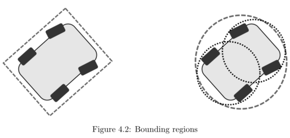

# A_Real_time_Hybrid_A_star_Implementation_for_Fast

KARL KURZER  ，2016

[TOC]

# 摘要

在实现全自动驾驶汽车的道路上，有许多挑战需要克服。一个常见的问题是，在不提供任何特定结构（没有首选的移动方式）的环境中，车辆从起始姿态到目标姿态的导航。这种环境的典型例子是停车场或建筑工地；在这种情况下，车辆需要安全地绕过障碍物，理想情况下使用起始和目标姿态之间地最佳路径（关于特定参数）。

整个硕士论文的工作重点是为位于瑞典斯德哥尔摩的KTH皇家理工学院综合交通研究实验室(ITRL)的研究概念车(RCV)开发一种合适的路径规划算法。

路径规划器的开发需要的不仅仅是单纯的算法，因为代码需要测试和各自的结果评估。此外，生成的算法需要以一种便于部署的方式进行包装，并且可以与测试车上的其它不同系统进行交互。因此，本文还试图对实现实验测试所需的实时计算能力的方法以及如何建立模拟和调试的可视化环境提供见解。

# Part1.导论和理论框架

## Chapter1 介绍

在实现全自动驾驶汽车的道路上，有许多挑战需要克服。自动驾驶汽车的一个关键部分是规划系统，该系统通常包含不同的抽象层，如任务、行为和运动规划。任务规划器在路网中提供到达目标的合适路线，而行为规划器在交通中决定适当的行动，如改变车道和十字路口停车；另一方面，运动规划器在较低的水平操作，避开障碍物，同时朝着局部目标[38]前进。

一个更专业的问题是，在不提供任何特定结构的环境中，车辆从起始姿态到目标姿态的导航；非结构化驾驶相对于结构化驾驶（跟随道路）。这种环境的典型例子是停车场或建筑工地。在这些场景中，车辆需要在没有任何路径参考（如车道标记）的情况下安全地绕过障碍物，理想情况下使用起始位置和目标位置之间地最佳路径。

### 1.1 Relevance of the Topic 话题相关

在撰写本文时，自动驾驶汽车可能是最公开讨论和研究地工程话题之一。传统汽车制造商的研发速度似乎非常缓慢，而美国的Alphabet（原名Google），Comma.ai，drive.ai，Uber，英国的OXBOTICA，亚洲的ZMP，Robot Taxi和nuTonomy正在加速自动驾驶汽车技术的发展，并在十年内推出自动驾驶汽车。一个简单的查询和搜索属于驱动的谷歌趋势将强调这一点，揭示了在过去六年中搜索量的巨大增长，如图1.1所示。

在一项名为“驾驶座椅的革命：自动驾驶之路”的研究中，波士顿咨询集团将特斯拉2015年发布的Autopilot定义为部分自动驾驶到完全自动驾驶的第一阶段。此外，它们估计，完全自动驾驶汽车将在2025年来临。美国消费者购买自动驾驶汽车的最主要原因是安全性的提高，更低的保险费，以及在汽车行驶过程的生产力和多任务能力[31]。

对于整个社会来说，最重要的好处将是事故的减少，因为90%是人为错误导致的。据麦肯锡公司(McKinsey & Company)报告，自动驾驶汽车的其他好处还包括减少停车所需的空间消耗（自动驾驶汽车不需要空间开门，约占15%）[3]。

### 1.2 Context of the Thesis 论文背景

KTH综合交通研究实验室(ITRL)正在响应长期多学科研究合作的需要，通过全新的和整体的技术解决方案来应对全球环境交通的挑战。ITRL的方法是，无缝的交通服务、基础设施、新颖的汽车理念、商业模式和政策，都需要协调和优化。

实验概念车(Research Concept Vehicle,RCV)是ITRL新技术解决方案研究的一个关键角色，它是各种研究课题的试验台，涵盖了车辆的设计、控制、感知、规划以及系统集成等领域。

由于自动驾驶将成为全球环境交通挑战解决方案的一部分，这篇论文和它们论文的目的是逐步增强RCV实现自动驾驶的能力。因此，本论文将是一个更大的项目的一部分。

### 1.3 Problem Description

本文要解决的问题可以概括为以下几个方面。

在非结构化环境中，基于二维障碍物图的输入，实时找到一个将非完整车辆碰撞从给定的起始姿态转换为期望目标姿态的解决方案，或者报告不存在这样的解决方案。

图1.2描述了这个问题。路径将车辆从开始状态安全过渡到目标状态，同时保持车辆最小的转弯半径并避开障碍物。

### 1.4 Scope and Aims 范围和目标

以下列出的要点描述了这篇论文的关键要求：

1. 根据局部障碍物地图进行规划
2. 结合非完整约束
3. 确保实时性能
4. 对结果进行分析和评估
5. 集成和自动驾驶（可选）

路径规划算法的输入是基于网格的二进制障碍图。第二点指出，规划器应该用于不能在现场转弯的车辆，例如汽车，因此产生的路径必须是连续的，而且需要基于车辆的模型。为了将算法应用到汽车上，需要不断地重新规划并进行碰撞检测。为了达到这个目的，实际地实现需要尽可能地高效，因此必须使用C++来进行规划算法地实现。开发应包括对算法及其结果地关键分析和评估。其目标是在RCV上部署该软件，并在现实场景中展示其能力，如果时间和其他限制条件允许的话。

论文的范围是原型开发和实现一个路径规划算法，因此这集中在一个具体的解决方案，而不是一个通用的，不会提供不同的方法之间的比较。

### 1.5 Structure of the Thesis 论文的结构

本文分为两个不同的部分。

* 第一章将给出理论基础，为读者实际实现算法做准备。

* 第二章简要介绍了路径规划所针对的车辆平台。
* 第三章简要介绍了路径规划，剖析了这一术语，并涉及了一些流行的方法。
* 第四章主要讨论碰撞检测，因为它是大多数路径规划方法的重要组成部分。
* 第五章剖析了目前流行的图搜索算法，为本文的研究奠定了基础。

第二章详细介绍了该方法及其实现。

* 第七章运动理论框架对实现的混合A*搜索进行了详细的说明。
* 第八章主要是对结果的收集和分析。
* 第九章对全文进行了总结，同时强调了具体实施的成果。
* 第十章将给读者一些关于未来可以或者应该进行的工作建议。

## Chapter 2 车辆平台

概念车的开发始于2012年。这款电动双座汽车配备了四个自动转向模块，使其能够根据转向角度、弧度、驱动力或制动力独立驱动每个车轮。这辆车重约400公斤，在正常情况下可行驶1小时，最高时速可达70公里每小时。由于执行器是线控的而不是机械控制的，它开辟了一整套新的功能，可以提高操作、效率和安全性。

该车辆配备了各种传感器，不断收集有关车辆及其环境的状态数据。占栅格采用激光雷达传感器检测障碍物，采用GPS、IMU、转向角和轮速进行定位。

## Chapter 3 路径规划

完全自主的机器人需要能够理解高级命令，因为它的目标不是告诉机器人如何做某件事，而是告诉机器人做什么[23]。虽然自主机器人需要能够充分推理、感知和控制自己，但规划扮演着关键角色。规划利用机器人对世界的了解，为其执行器（控制器）提供适当的动作（参考），以执行手边的任务。机器学习可能仍然是人工智能中最大的领域之一，但规划可以被视为对它的必要补充，因为来未来，决策需要基于学习自主形成[26].

本节将介绍并讨论各种不同的规划技术，其中许多不仅适用于路径规划，而且是解决更一般问题的强大工具[26}。

### 3.1 Planning

首先，我们应该理解“Planning"这个词的含义。Meriam Webster给出了以下简单的定义：”为实现或为做某事而制定计划的行为或过程“。考虑到这个一般性的描述，很明显，一个人可以通过说planning这个词表示非常不同的事情，下面这些都可以被看作是planning的行为：

1. 打算使用公共交通工具去看望某人的人
2. 签署法案以说服选民的政治家
3. 一种计算旅行路线的导航系统

在这篇论文中，规划被理解为寻找一组从给定的开始状态过渡到期望的目标状态的行动。当规划由计算机来执行时，人们必须通过编程来完成，结果就是一个规划算法，它通常返回一组将开始状态过渡到目标状态的操作。不考虑不确定性下的规划，因此本文不考虑表述2.

### 3.2 Path

如果规划器返回从开始状态过渡到目标状态所需的一组动作，那么可以说一条路径由整个动作集$u \in U_{path}$以及沿路径$x \in X$的结果状态组成。更具体的说，本文中的路径是一组动作$U_{path}$使车辆通过欧几里得二维平面从当前开始状态移动到所需的目标状态，或者是由此产生的姿态$p \in P$,其中$X \to P$.

而Latombe使用的是运动规划，Lavealle使用的是路径规划，它们可能在解释的方式上有一些细微的差别，但通常它们被用于相同的事情。

### 3.3 Basic Problem

本文所要解决的问题有待进一步的说明，并建立一个一般的公式。机器人是世界上唯一可以移动的物体。不考虑机器人的动力学，因此消除了任何时间依赖性。由于碰撞不会发生，它们也不会被建模。基于这些简化，基本问题可以描述为[23,26].

* $A \subset W$,机器人，是世界上一个单一的运动刚体，用欧几里得空间$R^2$表示

* $O \subset W$，障碍物，是$W$中静止的刚体

* $A和O$的几何、位置、方向是先验已知的

* **问题**：给定$A \subset W$的初始和目标姿态，规划一条表示姿态集的路径$P \subset W$，使得$A(p) \cap O=\phi$对于沿从初始到目标的路径的任何姿态$p \in P$，如果已找到路径或不存在该路径，终止并报告$P或\phi$​.

### 3.4 Configuration Space

在运动规划的文献中，构型空间的概念已经得到了很好的建立，因为构型空间有利于路径规划问题的制定，以一种表达能力更强的底层方案来呈现各种概念[23,26]。构型空间在80年代被Lozano-Perez广泛用于描述空间规划问题，例如：在有障碍物的非结构化环境中寻找放置物体的适当空间或寻找物体的路径[23]。寻找合适的位置或物体应该走的路径，是设计和应用中经常遇到的问题，在设计和应用中，需要实现紧凑性，但不应牺牲可维护性。这方面的一个例子是更换汽车前灯灯泡。制造商们正努力把它建造的更尽可能紧凑，但很明显，这需要可维护性，因为一个灯泡可能需要不时地更换。构型空间表示的优点是将问题从一个刚体简化为一个点，从而简化了搜索过程[29]。

假设机器人或agent$A \subset W$，$W$是...

### 3.5 Popular Approaches

与大多数问题一样，根据要解决的问题的要求，有各种不同的路径规划方法。本节的目的不是比较路径规划的方法。正如在许多其他地方讨论的那样，每种方法都有优缺点，但它应该让读者快速了解针对同一问题的不同类型的解决方案。

#### 3.5.1 RRT

废话咋这么多呢

#### 3.5.2 Potential Fields 势场法

#### 3.5.3 Approximate Cell Decomposition 近似栅格分解

### 3.6 Differential/Kinematic Constraints 微分/运动学约束

本节主要关注类车机器人的微分约束。大多数时候，这些微分约束是机器人固有的运动学和动力学约束。这些约束条件需要在某一点上考虑，理想的情况是在实际的路径规划过程中确保路径匹配机器人的约束条件。如果在规划过程中考虑约束是不可行的，也可以将该任务交给控制模块。然而，考虑到这些限制条件，这也不是一项容易的任务[26]。

即使汽车可以到达欧几里得平面的任何位置和方向，构型为$q=(x,y,\theta)$，它的构型空间因此是$C=R^2 \times S^1$,它不能自由平移或旋转。汽车既可以前进也可以后退，但不能侧移。这意味着可能的动作比自由度要少，像这样的系统被成为欠驱动[26]。

汽车驾驶员的一个常见情况是平行车位停车，为了实现与$q_0$平行的构型$q_1$，汽车至少需要旋转和平移，同样，对于第3个构型$q_2$，对于$q_0$具有相同位置但是不同方向，也需要旋转和平移[23]。

不允许车辆侧向移动而只能沿航向方向移动的约束可以表示为与车辆航向垂直的侧向速度始终等于0，这个速度用$v \bot$表示.
$$
v \bot=\frac{\dot{x}}{cos(\theta-\pi/2)} \quad (3.1) \\
v \bot=\frac{-\dot{y}}{sin(\theta-\pi/2)} \quad (3.2)  \\
\frac{\dot{x}}{cos(\theta-\pi/2)}=\frac{-\dot{y}}{sin(\theta-\pi/2)} \quad (3.3)\\
\dot{x}sin(\theta-\pi/2)+\dot{y}cos(\theta-\pi/2)=0 \quad (3.4) 
$$
得到此非完整约束。
$$
\dot{x}cos(\theta)-\dot{y}sin(\theta)=0 \quad (3.5)
$$

> $$
> sin(\theta-\pi/2)=sin\theta *cos(\pi/2)-cos\theta *sin(\pi/2) =-cos\theta\\
> cos(\theta-\pi/2)=cos\theta*cos(\pi/2)+sin\theta*sin(\pi/2)=sin\theta
> $$
>

#### 3.6.1 Dubins Curves

1957年Dubins发表了一篇论文，表明粒子的状态$x_0,x_1\in X$之间的最小路径长度存在解析解。这样的路径将沿沿着整体曲率，曲率$r^{-1}$是最小转弯半径 $r$ 的上边界。他表明，即使是这些最短路径中最复杂的，也可以使用最多三个线段来表示，仅由具有上限曲率$r^{-1}$​的曲线C以及直线S、CCC或CSC组成。因此Dubins创建第一个解析解来解决路径规划问题，在常数时间内给出一个上边界曲率，应用于一辆普通汽车的非完整性质。Dubins的方法在障碍物稀疏环境中作为路径规划的启发式方法尤其有用，因为它不考虑障碍物，因此当障碍物密度增加时，路径更容易与环境发生碰撞。

图3.6中的虚线描述了一条Dubins曲线，它由C、S和C段组成。

#### 3.6.2 Reeds-Shepp Curves

三十多年后的1990年，Reeds和Shepp解决了一个似乎与Dubins相似的问题。它们开发了一种计算曲率上限路径的解决方法，假设汽车既可以向前也可以向后行驶。在一组永远不会超过68条的可能路径中，可以找到最大值为2个尖点（由于可以反向）的解。在可能的路径池中，最小长度的路径就是解。就行Dubins曲线一样，Reeds-Shepp曲线也由曲线和直线段组成。由于反向的可能性，路径将由最多5段组成，CCSCC[34].

图3.6中的实线描述了Reeds-Shepp曲线，它与本例中的Dubins曲线一样由C、S和C段组成。

## Chapter 4 碰撞检测

碰撞检测是一种基本的几何操作，适用于计算机游戏、机器人和工程模拟等许多应用[7,14,33]。虽然一些难以建模和计算密集的规划方法自然地产生无碰撞路径，但其他方法，如在第3章中介绍地方法，要求在它们产生地路径上进行显式地碰撞检查[26]。碰撞检测表示一个总体情况：是否、何时、何地两个物体发生碰撞[14]。图4.1显示了一个非碰撞自由路径的示例。下面关心的是”if"（是否）。另一种区别是关于离散检测和连续检测。虽然静态碰撞检测的计算开销比较小，但它有隧道效应的风险，即两个物体可能从一个时间到另一个时间步穿过，而碰撞无法被检测到[14]。

基于提供的信息，由运动规划算法生成的路径$P$需要无碰撞，因此$P\in C_{freee}$. 如果机器人的环境发生变化，即$P \cup C_{obs} \neq \emptyset$​, 那么就计算新的路径。在每次环境更新时重新计算路径是有益的，还是只对给定环境更改的前方路径执行碰撞检查，这取决于具体情况。

碰撞检测可以通过多种方式进行。虽然构型空间的使用是有益的，因为他的表达能力和冗长，它可能不是有用的实际碰撞检测[26]。需要考虑的重要事情是检查$q\in P \Lambda q \in C_{free}$​对于给定配置q是否为真的计算成本，这可以看作是一个逻辑述语[26]。一条路径只有它的整个状态都是无碰撞的，才被认为是安全的，那么需要沿着同一条路径的整个长度进行碰撞检测[14,26]。现在介绍两种方法。

### 4.1 Bounding Space and Hierarchies 空间边界和层次结构

出于性能方面的考虑，通常使用边界空间来包装对象是有益的。边界空间是用简单的体$R^3$或者面$ R^2 $​来封装更复杂的对象。这个方法可以更快的碰撞检测。根据所需的精度，只检查这些边界空间的碰撞就足够了[14,26]

。

在精度要求较高的情况下，可以采用分层的方法，将较大的复杂凸体分解为树状结构。树表示包含原始对象越来越小的子集的边界空间，如图4.2所示。这种层次结构可以更精确地描述对象地几何形状，同时减少了交集测试地计算成本，因为子对象只需要在其较大的父对象碰撞时进行测试[14,26]。

Lavelle和Ericson定义了选择适当边界空间的一些标准。

* 空间应该尽可能地适应物体。
* 两个空间的相交检测应该尽可能有效。
* 空间应该易于旋转。

图4.2说明了使用边界区域的两种不同方式。在左边，一个矩形形状用于近似，而在右边，形状被分解为两个层次，使用圆圈近似。对于后者，使用圆圈边界区进行简单的障碍物碰撞检测，包括计算中心的相对距离以及计算该距离是否大于两个区域的组合半径。

### 4.2 Spatial Occupancy Enumeration 空间占用枚举

空间占用枚举用网格覆盖空间。这种空间细分允许对象的占用枚举，存储由各自对象覆盖的网格单元的详尽数组[14,19]。该方法如图4.3所示。在$R^2 $空间这些可能是正方形，在$R^3 $​是立方体。这种方法提供了一种简单的碰撞检测，可以快速进行[14,19]。枚举法的缺点是需要重新计算给定的路径的每个点的各自空间占用[19]。可以通过对方向值进行离散化来避免这个问题，这样占用率枚举就可以存储在一个查表中[39]。

由于简单的统一的网格已经成为空间细分的流行选择，然而，选择正确的单元格大小是很重要的。单元格的大小和环境中物体的大小以及传感器信息的准确性相适应是很重要的。如果网格太细，碰撞检测将花费太长的时间，因为需要检查更多的网格单元，每个单元的传感器信息量将会更低。如果网格太粗糙，那么自由空间将被低估，使碰撞检查保守，并冒着路径规划算法无法找到求解方案的风险，即使是存在一个解决方案。在这种情况下，固定的单元格大小是一个问题，层次化网格可能是要给解决方案[14]。

## Chapter 5 Graph Search

这一章解释了理解graphs所需要的基本理论以及与之相关的术语。本章的后半部分重点阐述了不同的图搜索算法，这些算法是理解本文中搜索算法实现的基础。

### 5.1 Fundamentals

如图5.1所示的graph包含顶点$V$和边$E$. G表示图， $V=V(G)$是图的顶点集合。$E=E(G)$是图的边的集合, 边连接着图的顶点。一条图的边可以用x,y来描述，因为它连接顶点x和y。有至少一个公共顶点的边被认为是相邻的。至少有一条公共边的顶点称为相邻的[4]。

图可以是有向的，也可以是无向的。有向图有单向边，无向图有双向边。在下文中，“节点”和“顶点”可以互换使用。

#### 5.1.1 State Space of a Graph

虽然这一章被称为图搜索，但我们必须理解，这个述语可以被看作是对一组动作的搜索，这些动作将对象的状态从初始状态转移为期望的目标状态。基于这个一般性的描述，图搜索算法可以应用于从运动规划到人工智能的各种问题[26]。

以下定义是对图状态空间的一般描述，它借用了Lavalle的著名著作《规划算法》。

1. 非空状态空间 $x \in X$, 是有限或无限的状态集合。
2. 对于每个状态 $x \in X$, 有一个有限动作空间 $U(x)$
3. 状态转换函数 $f$ 产生一个状态 $f(x,u) \in X$ 对于每个 $x \in X$ 和 $u \in U(X)$. 状态转换公式通过 $f$ 求导得到，$x'=f(x,u)$.
4. 初始状态 $x_s \in X$
5. 目标状态集 $X_G \subset X$.

图 $G$ 的顶点 $V$ 可以认为是 $G$ 的状态 $X$ .因此，每个顶点都持有与特定状态相关的信息。边 $E$ 的最佳代表是动作空间 $U$. 从状态 $x \in X$ 到状态 $x' \in X$ 转换的边 $u\in U(x)$的状态转换函数为 $f(x,u)$.

#### 5.1.2 Open and Closed Lists

为了解释以下算法，需要特别注意两种类型的 lists。一个是open list $O$ ,代表搜索前沿的集合，那些还没有被拓展到，但有一个相邻顶点已经被拓展到的顶点。因此任何顶点 $v_i \in O$ 都是前沿的部分。另外一个是closed list $C$ ,代表那些一定被拓展到的顶点结合

> 被拓展的节点，可以理解为这个节点从open list中被弹出去搜索过临近节点，后被放入closed list中的节点。

**优先级队列**

根据算法的不同，这些列表需要作为优先队列来实现。优先队列是一种数据结构，它根据一个键将集合从大到小排列，反之亦然。基本优先级队列支持以下操作。所有这些操作都保持队列的顺序[36]. 

* 用给定键插入给定项
* 找出队列中最小的键值
* 从队列中删除键值最小的项

所选择的队列类型对上述操作的时间复杂度有相当大的影响。在实现队列时，建议考虑这一点，因为更复杂的队列可能会产生更好的性能，尤其是处理较大的$数据集^1$时.

> $^1$While C++ implements a basic priority queue in the std name space http://en.cppreference.com/w/cpp/container/priority_queue other more advanced queues (Binomial, Fibonacci, etc.) can for example easily implemented with a library such as Boost http://www.boost.org/doc/libs/1_60_0/doc/html/heap.html

#### 5.1.3 Heuristics

为了找到最优路径，需要系统地进行搜索。各种搜索算法在扩展顶点地方式上差别很大[26]。为了避免浪费搜索图中没有希望的区域，搜索必须尽可能地知情，只拓展到有可能属于最优路径的节点[18]。如果搜索使用的信息导致跳过特定节点的扩展，因此无法找到最优路径，则丧失可接受性。理想的启发式算法返回一个顶点的实际代价。

为了解决处理能力的局限性，启发式被用作近似解决方案的辅助方法，在某些情况下大大减少了搜索空间。有限的时间只允许有限数量的计算。尽管这并不令人惊讶，但对于那些随着搜索深度呈指数增长的问题来说，这仍然是一个主要的限制。当搜索一个图时，搜索需要决定扩展哪个顶点和选择哪条边。旨在回答这个问题的信息被认为是启发式的。启发式可能基于当前顶点和目标顶点之间的一些成本估算[32].

启发式是一种函数，它提供了必要的信息，允许算法更快地向目标收敛。只有可采纳的启发式才能得到最优结果[18]。

#### 5.1.4 Optimality 最佳性

与其他路径规划方法相比的一大优点是许多图搜索算法都被证明是最优的。Bellman的最优原则如下所示：

*一个最优策略具有这样的性质：无论初始状态和初始决策是什么，剩余的决策必须构成与第一个决策产生的状态有关的最优策略。*

本质上，需要一系列决策的问题的任何最优解都只能由最优子解组成。

**Lemma 5.1.1.** 给定一个权重，

# 参考文献

**[1]**  John Amanatides, Andrew Woo, et al. A fast voxel traversal algorithm for ray tracing.32  
**[2]**  Richard Bellman.Dynamic programming. Dover Publications, Mineola, N.Y., dover ed. edition, 2003.20  
**[3]**  Michele Bertoncello and Dominik Wee. Ten ways autonomous driving could redefine the automotive world, 2015.3  
**[4]**  Bela Bollobas. Fundamentals, 1979.18  
**[5]**  Stephen P. Boyd and Lieven Vandenberghe.Convex optimization. Cambridge University Press, Cambridge, 2004.35  
**[6]**  Rodney A. Brooks and Tom´ as Lozano-P´ erez. A subdivision algorithm in configuration space for findpath with rotation.IEEE Transactions on Systems, Man, and Cybernetics, SMC-15(2):224–233, 1985.11  
**[7]**  B. Chazelle and D. P. Dobkin. Intersection of convex objects in two and three dimensions.Journal of the ACM (JACM), 34(1):1–27, 1987.15  
**[8]**  Thomas H. Cormen.Introduction to algorithms. MIT Press, Cambridge, Mass., 3rd ed. edition, 2009.21,22  
**[9]**  E. W. Dijkstra. A note on two problems in connexion with graphs.Numerische Mathematik, 1(1):269–271, 1959.22  
**[10]**  Dmitri Dolgov and Sebastian Thrun. Autonomous driving in semistructured environments: Mapping and planning. pages 3407–3414, 2009.25  
**[11]**  Dmitri Dolgov, Sebastian Thrun, Michael Montemerlo, and James Diebel. Practical search techniques in path planning for autonomous driving. 2008.25,29,34  
**[12]**  Dmitri Dolgov, Sebastian Thrun, Michael Montemerlo, and James Diebel.Path planning for autonomous vehicles in unknown semi-structured environments.The International Journal of Robotics Research, 29(5):485–501,2010.25,34  
**[13]**  L. E. Dubins. On curves of minimal length with a constraint on average curvature, and with prescribed initial and terminal positions and tangents. American Journal of Mathematics, 79(3):497, 1957.13  

**[14]**  Christer Ericson.Real-time collision detection. Morgan Kaufmann series in interactive 3D technology. Elsevier, Amsterdam and London, 2005.15, 16,17  
**[15]**  Ariel Felner. Position paper: Dijkstra’s algorithm versus uniform cost search or a case against dijkstra’s algorithm. 2011.22  
**[16]**  Dave Ferguson, Thomas M. Howard, and Maxim Likhachev. Motion planning in urban environments part i. pages 1063–1069, 2008.29,50  
**[17]**  Dave Ferguson, Thomas M. Howard, and Maxim Likhachev. Motion planning in urban environments part ii. pages 1070–1076, 2008.29  
**[18]**  Peter E. Hart, Nils J. Nilsson, and Bertram Raphael. A formal basis for the heuristic determination of minimum cost paths.IEEE Transactions on Systems Science and Cybernetics, 4(2):100–107, 1968.20,21,24  
**[19]**  V. Hayward. Fast collision detection scheme by recursive decomposition of a manipulator workspace, 1986.16,17  
**[20]**  S. Karaman and E. Frazzoli. Incremental sampling-based algorithms for optimal motion planning. In Yoky Matsuoka, Hugh F. Durrant-Whyte, and Jos´ e Neira, editors,Robotics, volume 06, Cambridge, MA, 2011. MIT Press.29  
**[21]**  O. Khatib. Real-time obstacle avoidance for manipulators and mobile robots.The International Journal of Robotics Research, 5(1):90–98, 1986.10  
**[22]**  Yoshiaki Kuwata, Gaston A. Fiore, Justin Teo, Emilio Frazzoli, and Jonathan P. How. Motion planning for urban driving using rrt. 2008.29,50  
**[23]**  Jean-Claude Latombe.Robot Motion Planning, volume 124 ofThe Springer International Series in Engineering and Computer Science, Robotics: Vision, Manipulation and Sensors. Springer US, Boston, MA, 1991.7,8,9,11,12  
**[24]**  S. M. Lavalle. Rapidly-exploring random trees: a new tool for path planning. 1998.10  
**[25]**  S. M. Lavalle and J. J. Kuffner. Randomized kinodynamic planning. 1:473–479 vol.1, 1999.10  
**[26]**  Steven Michael LaValle.Planning algorithms. Cambridge University Press,Cambridge, 2006.7,8,9,11,12,15,16,19,20,21,22  
**[27]**  C. Y. Lee. An algorithm for path connections and its applications.IRE Transactions on Electronic Computers, EC-10(3):346–365, 1961.21  
**[28]**  Maxim Likhachev, Dave Ferguson, Geoff Gordon, Anthony Stentz, and Sebastian Thrun. Anytime dynamic a*: An anytime, replanning algorithm.  

**[29]**  T. Lozano-Perez. Spatial planning: A configuration space approach.IEEE Transactions on Computers, C-32(2):108–120, 1983.8  
**[30]**  Michael Montemerlo, Jan Becker, Suhrid Bhat, Hendrik Dahlkamp, Dmitri Dolgov, Scott Ettinger, Dirk Haehnel, Tim Hilden, Gabe Hoffmann, Burkhard Huhnke, Doug Johnston, Stefan Klumpp, Dirk Langer, Anthony Levandowski, Jesse Levinson, Julien Marcil, David Orenstein, Johannes Paefgen, Isaac Penny, Anna Petrovskaya, Mike Pflueger, Ganymed Stanek,David Stavens, Antone Vogt, and Sebastian Thrun. Junior: The stanford entry in the urban challenge.Journal of Field Robotics, 25(9):569–597,
2008.25  
**[31]**  Xavier Mosquet, Thomas Dauner, Nikolaus Lang, Michael Russmann, Antonella Mei-Pochtler, Rakshit Agrawal, and Florian Schmieg. Revolution in the driver’s seat: The road to autonomous vehicles.3  
**[32]**  Allen Newell and Herbert A. Simon. Computer science as empirical inquiry: symbols and search.Communications of the ACM, 19(3):113–126, 1976.20  
**[33]**  M. K. Ponamgi, D. Manocha, and M. C. Lin. Incremental algorithms for collision detection between polygonal models.IEEE Transactions on Visualization and Computer Graphics, 3(1):51–64, 1997.15  
**[34]**  J. A. Reeds and L. A. Shepp. Optimal paths for a car that goes both forwards and backwards.Pacific Journal of Mathematics, 145(2):367–393,1990.14  
**[35]**  Stuart J. Russell, Peter Norvig, and Ernest Davis.Artificial intelligence: A modern approach. Prentice Hall series in artificial intelligence. Prentice Hall, Upper Saddle River, 3rd ed. edition, 2010.21  
**[36]**  Steven S. Skiena.The algorithm design manual. Springer, London, 2nd ed. edition, 2008.19,21  
**[37]**  C. Urmson and R. Simmons. Approaches for heuristically biasing rrt growth, 2003.10  
**[38]**  Chris Urmson, Joshua Anhalt, Drew Bagnell, Christopher Baker, Robert Bittner, M. N. Clark, John Dolan, Dave Duggins, Tugrul Galatali, Chris Geyer, Michele Gittleman, Sam Harbaugh, Martial Hebert, Thomas M. Howard, Sascha Kolski, Alonzo Kelly, Maxim Likhachev, Matt Mc Naughton, Nick Miller, Kevin Peterson, Brian Pilnick, Raj Rajkumar, Paul Rybski, Bryan Salesky, Young-Woo Seo, Sanjiv Singh, Jarrod Snider, Anthony Stentz, William “Red” Whittaker, Ziv Wolkowicki, Jason Ziglar,Hong Bae, Thomas Brown, Daniel Demitrish, Bakhtiar Litkouhi, Jim Nickolaou, Varsha Sadekar, Wende Zhang, Joshua Struble, Michael Taylor,Michael Darms, and Dave Ferguson. Autonomous driving in urban environments: Boss and the urban challenge.Journal of Field Robotics, 25(8):425–466, 2008.2,29  
**[39]**  Jens Ziegler, Moritz Werling, and Jochen Schroder.Navigating car-like robots in unstructured environments using an obstacle sensitive cost function. IEEE, 2008.17  
