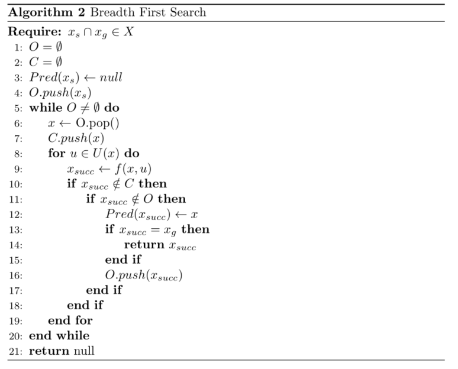

# A_Real_time_Hybrid_A_star_Implementation_for_Fast

KARL KURZER  ，2016

[TOC]

# 摘要

在实现全自动驾驶汽车的道路上，有许多挑战需要克服。一个常见的问题是，在不提供任何特定结构（没有首选的移动方式）的环境中，车辆从起始姿态到目标姿态的导航。这种环境的典型例子是停车场或建筑工地；在这种情况下，车辆需要安全地绕过障碍物，理想情况下使用起始和目标姿态之间地最佳路径（关于特定参数）。

整个硕士论文的工作重点是为位于瑞典斯德哥尔摩的KTH皇家理工学院综合交通研究实验室(ITRL)的研究概念车(RCV)开发一种合适的路径规划算法。

路径规划器的开发需要的不仅仅是单纯的算法，因为代码需要测试和各自的结果评估。此外，生成的算法需要以一种便于部署的方式进行包装，并且可以与测试车上的其它不同系统进行交互。因此，本文还试图对实现实验测试所需的实时计算能力的方法以及如何建立模拟和调试的可视化环境提供见解。

# Part1.导论和理论框架

## Chapter1 介绍

在实现全自动驾驶汽车的道路上，有许多挑战需要克服。自动驾驶汽车的一个关键部分是规划系统，该系统通常包含不同的抽象层，如任务、行为和运动规划。任务规划器在路网中提供到达目标的合适路线，而行为规划器在交通中决定适当的行动，如改变车道和十字路口停车；另一方面，运动规划器在较低的水平操作，避开障碍物，同时朝着局部目标[38]前进。

一个更专业的问题是，在不提供任何特定结构的环境中，车辆从起始姿态到目标姿态的导航；非结构化驾驶相对于结构化驾驶（跟随道路）。这种环境的典型例子是停车场或建筑工地。在这些场景中，车辆需要在没有任何路径参考（如车道标记）的情况下安全地绕过障碍物，理想情况下使用起始位置和目标位置之间地最佳路径。

### 1.1 Relevance of the Topic 话题相关

在撰写本文时，自动驾驶汽车可能是最公开讨论和研究地工程话题之一。传统汽车制造商的研发速度似乎非常缓慢，而美国的Alphabet（原名Google），Comma.ai，drive.ai，Uber，英国的OXBOTICA，亚洲的ZMP，Robot Taxi和nuTonomy正在加速自动驾驶汽车技术的发展，并在十年内推出自动驾驶汽车。一个简单的查询和搜索属于驱动的谷歌趋势将强调这一点，揭示了在过去六年中搜索量的巨大增长，如图1.1所示。

在一项名为“驾驶座椅的革命：自动驾驶之路”的研究中，波士顿咨询集团将特斯拉2015年发布的Autopilot定义为部分自动驾驶到完全自动驾驶的第一阶段。此外，它们估计，完全自动驾驶汽车将在2025年来临。美国消费者购买自动驾驶汽车的最主要原因是安全性的提高，更低的保险费，以及在汽车行驶过程的生产力和多任务能力[31]。

对于整个社会来说，最重要的好处将是事故的减少，因为90%是人为错误导致的。据麦肯锡公司(McKinsey & Company)报告，自动驾驶汽车的其他好处还包括减少停车所需的空间消耗（自动驾驶汽车不需要空间开门，约占15%）[3]。

### 1.2 Context of the Thesis 论文背景

KTH综合交通研究实验室(ITRL)正在响应长期多学科研究合作的需要，通过全新的和整体的技术解决方案来应对全球环境交通的挑战。ITRL的方法是，无缝的交通服务、基础设施、新颖的汽车理念、商业模式和政策，都需要协调和优化。

实验概念车(Research Concept Vehicle,RCV)是ITRL新技术解决方案研究的一个关键角色，它是各种研究课题的试验台，涵盖了车辆的设计、控制、感知、规划以及系统集成等领域。

由于自动驾驶将成为全球环境交通挑战解决方案的一部分，这篇论文和它们论文的目的是逐步增强RCV实现自动驾驶的能力。因此，本论文将是一个更大的项目的一部分。

### 1.3 Problem Description

本文要解决的问题可以概括为以下几个方面。

在非结构化环境中，基于二维障碍物图的输入，实时找到一个将非完整车辆碰撞从给定的起始姿态转换为期望目标姿态的解决方案，或者报告不存在这样的解决方案。

图1.2描述了这个问题。路径将车辆从开始状态安全过渡到目标状态，同时保持车辆最小的转弯半径并避开障碍物。

### 1.4 Scope and Aims 范围和目标

以下列出的要点描述了这篇论文的关键要求：

1. 根据局部障碍物地图进行规划
2. 结合非完整约束
3. 确保实时性能
4. 对结果进行分析和评估
5. 集成和自动驾驶（可选）

路径规划算法的输入是基于网格的二进制障碍图。第二点指出，规划器应该用于不能在现场转弯的车辆，例如汽车，因此产生的路径必须是连续的，而且需要基于车辆的模型。为了将算法应用到汽车上，需要不断地重新规划并进行碰撞检测。为了达到这个目的，实际地实现需要尽可能地高效，因此必须使用C++来进行规划算法地实现。开发应包括对算法及其结果地关键分析和评估。其目标是在RCV上部署该软件，并在现实场景中展示其能力，如果时间和其他限制条件允许的话。

论文的范围是原型开发和实现一个路径规划算法，因此这集中在一个具体的解决方案，而不是一个通用的，不会提供不同的方法之间的比较。

### 1.5 Structure of the Thesis 论文的结构

本文分为两个不同的部分。

* 第一章将给出理论基础，为读者实际实现算法做准备。

* 第二章简要介绍了路径规划所针对的车辆平台。
* 第三章简要介绍了路径规划，剖析了这一术语，并涉及了一些流行的方法。
* 第四章主要讨论碰撞检测，因为它是大多数路径规划方法的重要组成部分。
* 第五章剖析了目前流行的图搜索算法，为本文的研究奠定了基础。

第二章详细介绍了该方法及其实现。

* 第七章运动理论框架对实现的混合A*搜索进行了详细的说明。
* 第八章主要是对结果的收集和分析。
* 第九章对全文进行了总结，同时强调了具体实施的成果。
* 第十章将给读者一些关于未来可以或者应该进行的工作建议。

## Chapter 2 车辆平台

概念车的开发始于2012年。这款电动双座汽车配备了四个自动转向模块，使其能够根据转向角度、弧度、驱动力或制动力独立驱动每个车轮。这辆车重约400公斤，在正常情况下可行驶1小时，最高时速可达70公里每小时。由于执行器是线控的而不是机械控制的，它开辟了一整套新的功能，可以提高操作、效率和安全性。

该车辆配备了各种传感器，不断收集有关车辆及其环境的状态数据。占栅格采用激光雷达传感器检测障碍物，采用GPS、IMU、转向角和轮速进行定位。

## Chapter 3 路径规划

完全自主的机器人需要能够理解高级命令，因为它的目标不是告诉机器人如何做某件事，而是告诉机器人做什么[23]。虽然自主机器人需要能够充分推理、感知和控制自己，但规划扮演着关键角色。规划利用机器人对世界的了解，为其执行器（控制器）提供适当的动作（参考），以执行手边的任务。机器学习可能仍然是人工智能中最大的领域之一，但规划可以被视为对它的必要补充，因为来未来，决策需要基于学习自主形成[26].

本节将介绍并讨论各种不同的规划技术，其中许多不仅适用于路径规划，而且是解决更一般问题的强大工具[26}。

### 3.1 Planning

首先，我们应该理解“Planning"这个词的含义。Meriam Webster给出了以下简单的定义：”为实现或为做某事而制定计划的行为或过程“。考虑到这个一般性的描述，很明显，一个人可以通过说planning这个词表示非常不同的事情，下面这些都可以被看作是planning的行为：

1. 打算使用公共交通工具去看望某人的人
2. 签署法案以说服选民的政治家
3. 一种计算旅行路线的导航系统

在这篇论文中，规划被理解为寻找一组从给定的开始状态过渡到期望的目标状态的行动。当规划由计算机来执行时，人们必须通过编程来完成，结果就是一个规划算法，它通常返回一组将开始状态过渡到目标状态的操作。不考虑不确定性下的规划，因此本文不考虑表述2.

### 3.2 Path

如果规划器返回从开始状态过渡到目标状态所需的一组动作，那么可以说一条路径由整个动作集$u \in U_{path}$以及沿路径$x \in X$的结果状态组成。更具体的说，本文中的路径是一组动作$U_{path}$使车辆通过欧几里得二维平面从当前开始状态移动到所需的目标状态，或者是由此产生的姿态$p \in P$,其中$X \to P$.

而Latombe使用的是运动规划，Lavealle使用的是路径规划，它们可能在解释的方式上有一些细微的差别，但通常它们被用于相同的事情。

### 3.3 Basic Problem

本文所要解决的问题有待进一步的说明，并建立一个一般的公式。机器人是世界上唯一可以移动的物体。不考虑机器人的动力学，因此消除了任何时间依赖性。由于碰撞不会发生，它们也不会被建模。基于这些简化，基本问题可以描述为[23,26].

* $A \subset W$,机器人，是世界上一个单一的运动刚体，用欧几里得空间$R^2$表示

* $O \subset W$，障碍物，是$W$中静止的刚体

* $A和O$的几何、位置、方向是先验已知的

* **问题**：给定$A \subset W$的初始和目标姿态，规划一条表示姿态集的路径$P \subset W$，使得$A(p) \cap O=\phi$对于沿从初始到目标的路径的任何姿态$p \in P$，如果已找到路径或不存在该路径，终止并报告$P或\phi$​.

### 3.4 Configuration Space

在运动规划的文献中，构型空间的概念已经得到了很好的建立，因为构型空间有利于路径规划问题的制定，以一种表达能力更强的底层方案来呈现各种概念[23,26]。构型空间在80年代被Lozano-Perez广泛用于描述空间规划问题，例如：在有障碍物的非结构化环境中寻找放置物体的适当空间或寻找物体的路径[23]。寻找合适的位置或物体应该走的路径，是设计和应用中经常遇到的问题，在设计和应用中，需要实现紧凑性，但不应牺牲可维护性。这方面的一个例子是更换汽车前灯灯泡。制造商们正努力把它建造的更尽可能紧凑，但很明显，这需要可维护性，因为一个灯泡可能需要不时地更换。构型空间表示的优点是将问题从一个刚体简化为一个点，从而简化了搜索过程[29]。

假设机器人或agent$A \subset W$，$W$是...

### 3.5 Popular Approaches

与大多数问题一样，根据要解决的问题的要求，有各种不同的路径规划方法。本节的目的不是比较路径规划的方法。正如在许多其他地方讨论的那样，每种方法都有优缺点，但它应该让读者快速了解针对同一问题的不同类型的解决方案。

#### 3.5.1 RRT

废话咋这么多呢

#### 3.5.2 Potential Fields 势场法

#### 3.5.3 Approximate Cell Decomposition 近似栅格分解

### 3.6 Differential/Kinematic Constraints 微分/运动学约束

本节主要关注类车机器人的微分约束。大多数时候，这些微分约束是机器人固有的运动学和动力学约束。这些约束条件需要在某一点上考虑，理想的情况是在实际的路径规划过程中确保路径匹配机器人的约束条件。如果在规划过程中考虑约束是不可行的，也可以将该任务交给控制模块。然而，考虑到这些限制条件，这也不是一项容易的任务[26]。

即使汽车可以到达欧几里得平面的任何位置和方向，构型为$q=(x,y,\theta)$，它的构型空间因此是$C=R^2 \times S^1$,它不能自由平移或旋转。汽车既可以前进也可以后退，但不能侧移。这意味着可能的动作比自由度要少，像这样的系统被成为欠驱动[26]。

汽车驾驶员的一个常见情况是平行车位停车，为了实现与$q_0$平行的构型$q_1$，汽车至少需要旋转和平移，同样，对于第3个构型$q_2$，对于$q_0$具有相同位置但是不同方向，也需要旋转和平移[23]。

不允许车辆侧向移动而只能沿航向方向移动的约束可以表示为与车辆航向垂直的侧向速度始终等于0，这个速度用$v \bot$表示.
$$
v \bot=\frac{\dot{x}}{cos(\theta-\pi/2)} \quad (3.1) \\
v \bot=\frac{-\dot{y}}{sin(\theta-\pi/2)} \quad (3.2)  \\
\frac{\dot{x}}{cos(\theta-\pi/2)}=\frac{-\dot{y}}{sin(\theta-\pi/2)} \quad (3.3)\\
\dot{x}sin(\theta-\pi/2)+\dot{y}cos(\theta-\pi/2)=0 \quad (3.4) 
$$
得到此非完整约束。
$$
\dot{x}cos(\theta)-\dot{y}sin(\theta)=0 \quad (3.5)
$$

> $$
> sin(\theta-\pi/2)=sin\theta *cos(\pi/2)-cos\theta *sin(\pi/2) =-cos\theta\\
> cos(\theta-\pi/2)=cos\theta*cos(\pi/2)+sin\theta*sin(\pi/2)=sin\theta
> $$
>

#### 3.6.1 Dubins Curves

1957年Dubins发表了一篇论文，表明粒子的状态$x_0,x_1\in X$之间的最小路径长度存在解析解。这样的路径将沿沿着整体曲率，曲率$r^{-1}$是最小转弯半径 $r$ 的上边界。他表明，即使是这些最短路径中最复杂的，也可以使用最多三个线段来表示，仅由具有上限曲率$r^{-1}$​的曲线C以及直线S、CCC或CSC组成。因此Dubins创建第一个解析解来解决路径规划问题，在常数时间内给出一个上边界曲率，应用于一辆普通汽车的非完整性质。Dubins的方法在障碍物稀疏环境中作为路径规划的启发式方法尤其有用，因为它不考虑障碍物，因此当障碍物密度增加时，路径更容易与环境发生碰撞。

图3.6中的虚线描述了一条Dubins曲线，它由C、S和C段组成。

#### 3.6.2 Reeds-Shepp Curves

三十多年后的1990年，Reeds和Shepp解决了一个似乎与Dubins相似的问题。它们开发了一种计算曲率上限路径的解决方法，假设汽车既可以向前也可以向后行驶。在一组永远不会超过68条的可能路径中，可以找到最大值为2个尖点（由于可以反向）的解。在可能的路径池中，最小长度的路径就是解。就行Dubins曲线一样，Reeds-Shepp曲线也由曲线和直线段组成。由于反向的可能性，路径将由最多5段组成，CCSCC[34].

图3.6中的实线描述了Reeds-Shepp曲线，它与本例中的Dubins曲线一样由C、S和C段组成。

## Chapter 4 碰撞检测

碰撞检测是一种基本的几何操作，适用于计算机游戏、机器人和工程模拟等许多应用[7,14,33]。虽然一些难以建模和计算密集的规划方法自然地产生无碰撞路径，但其他方法，如在第3章中介绍地方法，要求在它们产生地路径上进行显式地碰撞检查[26]。碰撞检测表示一个总体情况：是否、何时、何地两个物体发生碰撞[14]。图4.1显示了一个非碰撞自由路径的示例。下面关心的是”if"（是否）。另一种区别是关于离散检测和连续检测。虽然静态碰撞检测的计算开销比较小，但它有隧道效应的风险，即两个物体可能从一个时间到另一个时间步穿过，而碰撞无法被检测到[14]。

基于提供的信息，由运动规划算法生成的路径$P$需要无碰撞，因此$P\in C_{freee}$. 如果机器人的环境发生变化，即$P \cup C_{obs} \neq \emptyset$​, 那么就计算新的路径。在每次环境更新时重新计算路径是有益的，还是只对给定环境更改的前方路径执行碰撞检查，这取决于具体情况。

碰撞检测可以通过多种方式进行。虽然构型空间的使用是有益的，因为他的表达能力和冗长，它可能不是有用的实际碰撞检测[26]。需要考虑的重要事情是检查$q\in P \Lambda q \in C_{free}$​对于给定配置q是否为真的计算成本，这可以看作是一个逻辑述语[26]。一条路径只有它的整个状态都是无碰撞的，才被认为是安全的，那么需要沿着同一条路径的整个长度进行碰撞检测[14,26]。现在介绍两种方法。

### 4.1 Bounding Space and Hierarchies 空间边界和层次结构

出于性能方面的考虑，通常使用边界空间来包装对象是有益的。边界空间是用简单的体$R^3$或者面$ R^2 $​来封装更复杂的对象。这个方法可以更快的碰撞检测。根据所需的精度，只检查这些边界空间的碰撞就足够了[14,26]

。

在精度要求较高的情况下，可以采用分层的方法，将较大的复杂凸体分解为树状结构。树表示包含原始对象越来越小的子集的边界空间，如图4.2所示。这种层次结构可以更精确地描述对象地几何形状，同时减少了交集测试地计算成本，因为子对象只需要在其较大的父对象碰撞时进行测试[14,26]。

Lavelle和Ericson定义了选择适当边界空间的一些标准。

* 空间应该尽可能地适应物体。
* 两个空间的相交检测应该尽可能有效。
* 空间应该易于旋转。

图4.2说明了使用边界区域的两种不同方式。在左边，一个矩形形状用于近似，而在右边，形状被分解为两个层次，使用圆圈近似。对于后者，使用圆圈边界区进行简单的障碍物碰撞检测，包括计算中心的相对距离以及计算该距离是否大于两个区域的组合半径。

### 4.2 Spatial Occupancy Enumeration 空间占用枚举

空间占用枚举用网格覆盖空间。这种空间细分允许对象的占用枚举，存储由各自对象覆盖的网格单元的详尽数组[14,19]。该方法如图4.3所示。在$R^2 $空间这些可能是正方形，在$R^3 $​是立方体。这种方法提供了一种简单的碰撞检测，可以快速进行[14,19]。枚举法的缺点是需要重新计算给定的路径的每个点的各自空间占用[19]。可以通过对方向值进行离散化来避免这个问题，这样占用率枚举就可以存储在一个查表中[39]。

由于简单的统一的网格已经成为空间细分的流行选择，然而，选择正确的单元格大小是很重要的。单元格的大小和环境中物体的大小以及传感器信息的准确性相适应是很重要的。如果网格太细，碰撞检测将花费太长的时间，因为需要检查更多的网格单元，每个单元的传感器信息量将会更低。如果网格太粗糙，那么自由空间将被低估，使碰撞检查保守，并冒着路径规划算法无法找到求解方案的风险，即使是存在一个解决方案。在这种情况下，固定的单元格大小是一个问题，层次化网格可能是要给解决方案[14]。

## Chapter 5 Graph Search

这一章解释了理解graphs所需要的基本理论以及与之相关的术语。本章的后半部分重点阐述了不同的图搜索算法，这些算法是理解本文中搜索算法实现的基础。

### 5.1 Fundamentals

如图5.1所示的graph包含顶点$V$和边$E$. G表示图， $V=V(G)$是图的顶点集合。$E=E(G)$是图的边的集合, 边连接着图的顶点。一条图的边可以用x,y来描述，因为它连接顶点x和y。有至少一个公共顶点的边被认为是相邻的。至少有一条公共边的顶点称为相邻的[4]。

图可以是有向的，也可以是无向的。有向图有单向边，无向图有双向边。在下文中，“节点”和“顶点”可以互换使用。

#### 5.1.1 State Space of a Graph

虽然这一章被称为图搜索，但我们必须理解，这个述语可以被看作是对一组动作的搜索，这些动作将对象的状态从初始状态转移为期望的目标状态。基于这个一般性的描述，图搜索算法可以应用于从运动规划到人工智能的各种问题[26]。

以下定义是对图状态空间的一般描述，它借用了Lavalle的著名著作《规划算法》。

1. 非空状态空间 $x \in X$, 是有限或无限的状态集合。
2. 对于每个状态 $x \in X$, 有一个有限动作空间 $U(x)$
3. 状态转换函数 $f$ 产生一个状态 $f(x,u) \in X$ 对于每个 $x \in X$ 和 $u \in U(X)$. 状态转换公式通过 $f$ 求导得到，$x'=f(x,u)$.
4. 初始状态 $x_s \in X$
5. 目标状态集 $X_G \subset X$.

图 $G$ 的顶点 $V$ 可以认为是 $G$ 的状态 $X$ .因此，每个顶点都持有与特定状态相关的信息。边 $E$ 的最佳代表是动作空间 $U$. 从状态 $x \in X$ 到状态 $x' \in X$ 转换的边 $u\in U(x)$的状态转换函数为 $f(x,u)$.

#### 5.1.2 Open and Closed Lists

为了解释以下算法，需要特别注意两种类型的 lists。一个是open list $O$ ,代表搜索前沿的集合，那些还没有被拓展到，但有一个相邻顶点已经被拓展到的顶点。因此任何顶点 $v_i \in O$ 都是前沿的部分。另外一个是closed list $C$ ,代表那些一定被拓展到的顶点结合

> 被拓展的节点，可以理解为这个节点从open list中被弹出去搜索过临近节点，后被放入closed list中的节点。

**优先级队列**

根据算法的不同，这些列表需要作为优先队列来实现。优先队列是一种数据结构，它根据一个键将集合从大到小排列，反之亦然。基本优先级队列支持以下操作。所有这些操作都保持队列的顺序[36]. 

* 用给定键插入给定项
* 找出队列中最小的键值
* 从队列中删除键值最小的项

所选择的队列类型对上述操作的时间复杂度有相当大的影响。在实现队列时，建议考虑这一点，因为更复杂的队列可能会产生更好的性能，尤其是处理较大的$数据集^1$时.

> $^1$While C++ implements a basic priority queue in the std name space http://en.cppreference.com/w/cpp/container/priority_queue other more advanced queues (Binomial, Fibonacci, etc.) can for example easily implemented with a library such as Boost http://www.boost.org/doc/libs/1_60_0/doc/html/heap.html

#### 5.1.3 Heuristics

为了找到最优路径，需要系统地进行搜索。各种搜索算法在扩展顶点地方式上差别很大[26]。为了避免浪费搜索图中没有希望的区域，搜索必须尽可能地知情，只拓展到有可能属于最优路径的节点[18]。如果搜索使用的信息导致跳过特定节点的扩展，因此无法找到最优路径，则丧失可接受性。理想的启发式算法返回一个顶点的实际代价。

为了解决处理能力的局限性，启发式被用作近似解决方案的辅助方法，在某些情况下大大减少了搜索空间。有限的时间只允许有限数量的计算。尽管这并不令人惊讶，但对于那些随着搜索深度呈指数增长的问题来说，这仍然是一个主要的限制。当搜索一个图时，搜索需要决定扩展哪个顶点和选择哪条边。旨在回答这个问题的信息被认为是启发式的。启发式可能基于当前顶点和目标顶点之间的一些成本估算[32].

启发式是一种函数，它提供了必要的信息，允许算法更快地向目标收敛。只有可采纳的启发式才能得到最优结果[18]。

#### 5.1.4 Optimality 最佳性

与其他路径规划方法相比的一大优点是许多图搜索算法都被证明是最优的。Bellman的最优原则如下所示：

*一个最优策略具有这样的性质：无论初始状态和初始决策是什么，剩余的决策必须构成与第一个决策产生的状态有关的最优策略。*

本质上，需要一系列决策的问题的任何最优解都只能由最优子解组成。

**Lemma 5.1.1.** 给定一个权重，有向图$G=(V,E)$ 有一个代价函数 $g:E \to R$ 让 $p=\{v_0,v_1,...,v_k \}$ 作为一条从顶点 $v_0$ 到顶点 $v_k$ 的最短路径，对于任意的$i和j,0 \leq i \leq j \leq k$,  $ p_{ij}=\{ v_i,v_{i+1} ,...v_j\}$ 是 $p$ 中从顶点 $v_i$ 到 $v_j$ 的子路径。则 $p_{ij}$ 是从 $v_i到v_j$ 的最短路径。

证明：如果我们分解路径 $p$ 为 $v_0 \stackrel{p_{0i}}{\to} v_i \stackrel{p_{ij}}{\to}v_j \stackrel{p_{jk}}{\to}v_k$, 则我们得到 $g(p)=g(p_{0i})+g(p_{ij})+g(p_{jk})$. 现在假设有一条从 $v_i到v_j$ 的路径 $p'_{ij}$,并且代价$g(p'_{ij})<g(p_{ij})$ ,则 $v_0 \stackrel{p_{0i}}{\to} v_i \stackrel{p'_{ij}}{\to}v_j \stackrel{p_{jk}}{\to}v_k$ 是一条从$v_o到v_k$ 的路径，并且代价 $ g(p_{0i})+g(p'_{ij})+g(p_{jk})$ 比 $g(p)$ 更小，这与 $p$ 是 $v_0$ 到 $v_k$ 的最短路径的假设相矛盾[8]。

####  5.1.5 Admissibility and Consistency 

在非负图上找到最优路径的算法被认为是可接受的[18]。使用启发式估计的算法需要使用从不高估成本的启发式算法，以便被认为是可接受的[35]。很明显，在$R^2$空间两点之间的欧几里得距离是可接受的，因为两点之间的最短距离是一条直线。

启发式的一致性意味着，从顶点 $v$ 到达目标顶点的启发式估计必须小于或等于 $v'$ 的估计加上动作成本，$h(v) \leq c(v,u,v')+h(v')$. 这是三角形不等式的一种情况，它构成了三角形的每条边不能长于另外两条边的和[35]。

#### 5.1.6 Completeness

如果算法在存在解决方案的情况下找到解决方案，或者正确地报告问题没有解决方案，则认为算法是完善的。

### 5.2 Breadth First Search 广度优先搜索

广度优先搜索(BFS)最先由Moore开发，由Lee在1961年出版[27]。 BFS算法在无加权图（具有等边代价的图）上工作。在最初的论文中，BFS被作者描述为 “一种直线几何形式下的从源点扩展的波的计算机模型" . BFS逐层遍历一个图，图中深度为 $k$ 的顶点都会在处理深度为为 $k+1$​ 的顶点之前被访问。

BFS 不考虑edge成本，而只考虑展开的数量，因此只能用于非加权图。然而在这些图上，BFS 是完整和最优的，尽管时间和内存复杂度很高，因为搜索没有被引导。

BFS遍历图G中的所有顶点V，直到算法终止（例如，由于满足了一个目标条件）。在搜索过程中，每个顶点 $x\in V$​ 都会将其状态从未发现变为已发现。为了跟踪BFS发现的路线，为每个顶点分配了一个方向，因此分配了一个predecessor。因此，起始顶点将是后继结果树的根，这是使BFS成为解决最短路径问题的合适选择的关键属性[36]。算法2描述了搜索的结构。BFS在先入先出系统中扩展顶点，closed list 用于避免不必要的对之前访问过的顶点展开

。

### 5.3 Dijkstra's or Uniform-Cost Search

虽然广度优先搜索提供了离散路径规划问题的最优解，但它不考虑边代价，因此其原始形式仅适用于均匀代价图。Dijkstra的搜索算法可以看到一些改进，尽管第一次发布比BFS早两年，在1959年。这一部分也被称为均匀代价搜索，正如Felner指出的那样，原始的Dijkstra算法比它在今天的教科书中经常传达的更接近于UCS[15]. Dijkstra在他的原始论文中间接引用了Bellman的最优性原则，这是算法最优的必要证明。

Dijstra算法开始将所有顶点划分为三个集合，closed set C, open set O(实际为优先队列)，以及剩余的顶点。最开始C和O是空的集合。在这之后，算法在算法3中描述的开始运行[9]。首先，起始顶点 $x_s$ 被放到open set。接下来，进入while循环，第5行，他返回目标顶点（第9行），如果是空集则返回null。当一个顶点被扩展时，它从O中删除，并放进C中。然后计算所有连接到顶点的边以及它们连接到的顶点。如果这些顶点中有任何一个不在C，那么我们就计算目前为止的成本 $g(x')=g(x)+l(x,u)$. 其中 $g(x)$ 表示从起始顶点到顶点 $x$ 的成本， $l(x,u)$ 表示给定动作u 从 $x到x'$ 的状态转移代价。如果结果代价低于到达该顶点的当前成本，或者该顶点不是O的元素，则该顶点的父节点和代价将被设置，并且优先队列中的位置分别将减少或添加到O [8,9,26]。

### 5.4 A* Search

如果有人认为Dijkstra搜索是BFS的改进，那么$A*$搜索可以看作是Dijkstra工作的改进。虽然Dijkstra将目前为止的代价 g 和图的每个顶点相关联以确定下一个要扩展的顶点，但 $A*$通过启发式增强了算法，允许在某些条件下更快地收敛，同时仍要确保其最优性[18]. 启发函数 $h(x)$ 是未来成本，基于对从状态 $x$ 到目标状态 $x_g$ 的成本的估计。正如Dijkstra，算法 $A*$ 也以 $O$ 和 $C$ 分别作为open list和closed list。就像Dijkstra算法一样，$A*$ 也以空的  $O$ 和 $C$  开始。搜索算法在算法4中描述，关键差异发生在第18行，这里启发式估计发挥作用，$x$ 的成本为 $f(x)=g(x)+h(x)$​ ，优先级队列将被排序。一个标准的启发式估计是二维问题的欧几里得范数，可以显著加快搜索速度，同时保持可接受性和最优性。

### 5.5 Hybrid A* Search

$hybrid A*$ $算法 ^2$ 成功应用在DARPA城市挑战赛，一个美国举办的机器人比赛，2007年。在接下来的几年里，Dolgov等人在[10-12,30]中给出了对该算法的见解。$hybrid A*$ 和 $A*$​​ 算法相似。关键的区别是，状态转换发生在连续空间而不是离散空间。先前的非完整机器人路径规划方法的最大缺点之一是，所得到的路径是离散的，因此通常无法执行，因为方向的改变是突然的而不是平滑的[12,30]。

> $^2$ The naming has not been consistent, variants are: hybrid A* and hybrid-state A*

虽然混合 $A*$ 搜索隐式地在离散网格上构建图，但顶点可以到达网格上个任何连续点。由于连续搜索空间不是有限的，因此采用网格单元的形式进行离散化，限制了图的增长。由于从顶点到顶点的转换没有预定义的形式，因此很容易将非完整性纳入状态转换中。搜索空间通常是三维的，因此状态空间 $X$ 是由 $x,y,\theta$ 组成，创建一个离散的立方体，其底部代表顶点位置 $x,y$ ，高度代表顶点的航向角。

算法5概括了混合 $A*$ 搜索的步骤。就像普通的 $A*$ 搜索一样，它首先定义空的集合 $O和C$ ,并将开始的状态设置为空，并把开始状态放入open list (第14行)。在第18行的while循环开始，只在open list为空或达到目标状态时终止，在第21行，因为可能没有完全达到目标状态，所以在比较之前使用21行的函数 $RoundState$ 对当前状态和目标状态进行舍入。如果当前被拓展的顶点不是目标顶点，将为所有可用的动作 $u\in U(x) $生成新的后续顶点(第25行)。如果后继不在 $C$ 中，则计算顶点的成本。如果某个顶点不在 $O$ 中，或者该顶点的成本比具有相同索引的顶点的成本要小(也已经在 $O$ 中), 那么后继节点将被分配一个指向其前一个节点的指针，到目前为止的成本和将要到来的成本将被更新。之后，顶点被放到open list中，或者使用新的值 $f(x_{succ})$​ 减小键值。需要注意的是，即使混合 $A*$ 为了修剪相似的分支而对状态进行了舍入，但扩展总是从状态的实际值而不是舍入的值进行。

> 这里的**键值**我认为是total cost吧
>
> **舍入**是说的节点，坐标和角度舍入到相应的分辨率的栅格中。

# Part 2 Method, Implementation and Results

## Chapter 6 Method

本文的第二部分详细介绍了混合 $A*$​​ 方法的实现及其仿真结果。本章将讨论解决导航问题的方法。

移动机器人在现实世界的导航，而不是离散世界，归结为一个复杂的，连续变量的优化问题。虽然对于离散空间 ($Dijkstra,A*$) 有大量的最优和快速的规划器，这些规划器趋向于产生非常不适合非完整车辆的解决方案，因为它们不是光滑的，并没有结合车辆约束特性[11]。使用state lattice方法已经解决了这些问题，然而，这种方法需要大量的动作预计算，以及考虑不同场景和适当地连接lattice的问题[16,17,38]。其他的方法，比如RRT ,对于高维空间中寻找解决方案特别有帮助，是否产生连续系统的解决方案，但固有的缺点是高度不确定性和趋同的解决方案不是最优的，并遭受bug陷阱问题[20]。RRT的次优性在[20]中已经被解决，其中一个已经证明接近最优的 $ RRT^*$ 版本被提出。由于其基本属性，它们在路径规划中的应用只能通过对原始RRT（biasing,heuristics等）的大量扩展才可行，Kuwata等人在[22]中演示了这一点。

基于 $A^*$ 的混合 $A^*$ 可以看作是最优、确定性和完整算法的扩展。混合 $A^*$ 是确定性的，由于使用了可容许启发式和路径平滑，产生的解在全局最优解的附近。启发式的有效使用大大减少了节点扩展，并使搜索快速收敛到解。

混合 $A^*$ 规划器可以分为三个不同的部分。混合 $A^*$ 搜索结合了车辆约束，使搜索信息充分的启发函数，允许快速收敛。以及使用梯度下降改进已找到的解的路径平滑。

为了评估所开发的算法，我们使用了第8章中介绍的不同场景。

### 6.1 Hybrid $A^*$ Search

如5.5节所述，混合 $A^*$（ $HA^*$)搜索扩展顶点是在连续空间而不是离散空间。尽管混合 $A^*$ 在连续空间中工作，但它通过修剪叶状态的搜索分支来对世界进行离散化描述。这样做是为了避免类似分支的增长，这些分支只对解决方案添加了很少的内容，但却极大地增加了搜索图的大小。

状态可以有 $X=(x,y,\theta)$ 表示，其中 $x,y,\theta$ 分表表示顶点的位置和顶点的朝向。给定顶点 $X$ 的动作集 $U$ 可以取任何形状$^1 $。

> $^1$ An opposing method is to use a state lattice, where a large amount of motion primitives connect cells always in a predefined manner. 相反的方法是使用state lattice，其中大量的运动基元总是以预定义的方法连接栅格。

为了遵循非完整车辆所施加的约束，顶点通过三个动作中的一个展开；最大左转向，最大右转向以及不转向。这将确保生成的路径总是可驾驶的，因为实际的车辆模型用于扩展顶点，即使它们可能导致过渡的转向动作。

$HA^*$不考虑车辆的速度，但根据$HA^*$的解可以很容易地计算出合适地速度剖面。

为了合并车辆的航向，使用了一个有限的三维长方体，它代表了车辆的的所有可能状态。在顶点处通过动作 $u\in U(x)$​ 展开，生成新的状态。如果一个新的状态落入一个已经被另一个顶点占据的网格单元中，并且新顶点的代价更低，旧顶点会被修剪（删除）。搜索将继续，直到一个顶点到达目标单元格，或者所有到达的单元格都已到达（open list为空）。

#### 6.1.1 Vertex Expansion and Branch Pruning 顶点扩展和分支修剪

搜索从车辆的当前状态开始，记为 $x_s$ . $HA^*$ 将生成6个后继顶点；三个向前行驶和三个向后行驶，图6.1描述了这个扩展过程。后继者是通过使用车辆的最小转弯半径$^2$的弧线产生的。

> $^2$ The arc length used for the expansion can be chosen arbitrarily, however a shorter length promises higher levels of resolution completeness, as the likelihood to reach each state is increasing. 扩展的弧长可以任意选择，然而更短的长度承诺更高的分辨率完整性水平，因为到达每种状态的可能性正在增加。

状态转换的代价是基于弧的长度。改变驾驶方向或反向驾驶会增加代价。转弯和反向驾驶的惩罚是相乘的（取决于道路的部门转向或反向），而改变驾驶方向的惩罚是恒定的。

对于每个后继者，将执行以下操作。如果后续顶点到达不属于封闭列表的三维长方体中的一个单元（意味着单元尚未展开），则继续计算。如果单元不是open list的一部分（意味着该单元之前没有被任何其他的顶点扩展到达）或者距离前驱顶点的代价加上到达该单元的后续顶点的顶点扩展的代价低于当前与该单元格相关联的顶点的成本，那么新的顶点将被分配一个指向其前任的指针，其前任的迄今为止成本加上扩展成本的总和将分配给其g值和将使用启发式方法估计未来代价并分配给它的h值。如果与后续节点具有相同单元格的a顶点在closed list或open list中，并且后续节点的g值不是更低，那么后续节点将被丢弃，分支将被剪枝。

在转向动作为右最大转向、无转向和左最大转向的情况下，弧长可简写为, $r|x_\theta-x'_\theta|$, r为车辆车辆最小转弯半径。

如果弧长比栅格的平方根短，顶点展开的后续者会到达相同的单元。如果发生这种情况，基于它们的成本来比较顶点是不够的。因此，比较是基于两个顶点的总估计代价。由于算法使用一致的启发式，这导致了这样的效果，即最优估计将更接近目标的顶点代价更高$^3$​。因此在前一个顶点上添加一个breaker，以说明启发式的一致性，算法说明了这一过程。如果后续顶点的代价更大，它将被丢弃，算法继续进行。

> $^3$The total estimated cost of a vertex $x$ is $f(x) =g(x) +h(x)$ and the successor cost $f(x) =g(x) +l(x, u) +h(x_{succ})$ using a consistent heuristic implies $h(x)≤l(x, u) +h(x_{succ})$

#### 6.1.2 Analytical Expansion

$HA^*$​ 规划器偶尔计算Dubins和Reeds Shepp曲线从当前节点扩展到目标点。这样做的部分原因是因为单独的离散化控制动作无法达到精确的连续目标位置，并且是为了提高搜索速度。检查搜索的是否与环境冲突，如果不存在冲突，搜索将终止。为了减少计算负荷，从每个顶点探测这些最优的点对点解是无益的，而是每n次迭代（在接近目标时增加频率）。此外，在接近目标或障碍物稀少的环境中这样做更合理，否则发生碰撞的可能性会更高，这使得这是一个昂贵的操作，几乎没有回报的机会

#### 6.1.3 Collision Checking

虽然有很多方法来确定一个车辆的配置是否为无碰撞，$q\in C_{free}$​. 第4.2节介绍的空间占用枚举方法用于碰撞检查。为了使这成为一个可行的解决方案，必须预先计算车辆的可能构型，并将其保存在一个查找表中。该方法的优点是可以在恒定时间内快速地对任何车辆构型进行碰撞检测。

由于查表可以轻易地转换为具有x和y整数坐标的二维栅格，只有不同的可能朝向需要考虑进来。为了计算由角点表示的形状的空间占用，可以使用Bresenham线算法，但它不能正确地占用两点之间地线相交地所有单元。然而，对于碰撞检查，需要有确定性，因此使用了[1]中描述的射线追踪算法，它正确地标记了线相交地所有单元格。

一旦基本边界框被计算，查找表将填充车辆的空间占用，同时使用 $\theta$ 离散步骤旋转它。为了考虑$HA^*$ 的混合特性，即车辆可以到达单元内的任何位置，栅格单元内的100个不同位置的空间占用也被预先计算。

### 6.2 Heuristics

虽然目标是产生接近最优的可驱动解，但重要的是要利用$A^*$作为知情搜索，实现启发式使算法快速收敛到解。 $HA^*$ 使用来自两个启发式的估计。由于这两种启发式算法都是可接受的，所以对于任何给定的状态，选择其中的最大值。这两种启发式方法捕获了问题非常不同的部分。如图6.2所示。约束启发式结合了车辆的限制，忽略了环境因素，而无约束启发式忽略了车辆因素，只考虑障碍物因素。

#### 6.2.1 Constrained Heuristic

约束启发式只考虑了车辆的特性，而忽略了环境。合适的候选曲线是Dubins或Reeds-Shepp曲线。这些曲线在3.6节中介绍了是前向或后向最大边界曲率下的最短路径长度。

由于这种启发式方法考虑了当前的航向和转弯半径，它确保了车辆以正确的航向接近目标。当汽车接近目标时，这一点尤其重要。出于性能原因，可以预先计算并存储在查找表中。这是可能的，因为它忽略了障碍物，因此不需要任何环境信息。由于它只提高了性能而没有提高解决方案的质量，所以没有实现查找表。

鉴于Dubins和Reeds-Shepp曲线都是最小的，这种启发式显然是可以接受的。

#### 6.2.2 Unconstrained Heuristic

无约束启发式忽略了车辆特性，只考虑了障碍物。估计是基于目标节点和当前被拓展顶点之间的最短距离。这个距离是使用标准的 $A^*$ 搜索的距离，在两维(x,y位置)上的欧几里得距离启发式。二维 $A^*$搜索使用当前顶点作为目标顶点，而 $HA^*$搜索的目标顶点作为起始顶点，这是有益的，因为$A^*$ 搜索的closed list存储了到目标的所有最短距离$g(x)$，因此可以用作查表，而不是在$HA^*$进行时启动新的搜索。

无约束启发式引导车辆远离死胡同和 u 型障碍物。

由于$HA^*$​可以到达栅格的任何点，因此无约束启发需要通过当前和目标顶点的连续坐标的绝对差值来折扣（可能说的是舍入吧）。

### 6.3 Path Smoothing

由于混合$A^*$算法产生的路径是可驾驶的，但往往是由不必要的转向动作组成，因此对结果进行处理是有益的，以获得更高程度的舒适性和anquanxing[11,12]. 为此，可以使用梯度下降平滑器来最小化由以下四项组成的与路径相关的 $P$. 
$$
P=P_{obs}+P_{cur}+P_{smo}+P_{vor} \quad (6.1)
$$
在这个代价函数中每一项都有一个特殊的目的，需要更详细的解释。

#### 6.3.1 Obstacle Term

这一项惩罚和障碍物的碰撞。对于所有顶点 $X_i$ ，其中 $|X_i-o_i| \leq d_{obs}$ 。定义的代价 $P_{obs}$ 是基于到下一个障碍物的距离。
$$
P_{obs}=w_{obs}\sum_{i=1}^N \sigma_{obs}(|X_i-o_i|-d_{obs}) \quad (6.2)
$$
其中 $X_i$ 是路径上的节点的位置 $x和y$。$o_i$ 是距离 $X_i$ 最近的障碍物的位置。$d_{obs}$ 是作为可以影响路径代价的距离障碍物的阈值。为了在接近障碍物时获得更大的惩罚，$\sigma _{obs}$ 是一个二次惩罚函数。$w_{obs}$ 是用于影响该项对路径更改的权重。

**梯度**：
$$
\frac{\partial \sigma_{obs}}{\partial X_i}=\frac{2(|X_i-o_i|-d_{obs})X_i-o_i}{|X_i-o_i|} \quad (6.3)
$$

#### 6.3.2 Curvature Term

为了保证可驾驶性，曲率的上限是路径每一个顶点的瞬时曲率，定义为 $\frac{\Delta \phi_i}{|\Delta X_i|} \gt k_{max}$.
$$
P_{obs}=w_{cur}\sum_{i=1}^{N-1} \sigma_{cur}(\frac{\Delta \phi_i}{|\Delta X_i|} - k_{max}) \quad (6.4)
$$
顶点 $X_i$ 的位移矢量定义为 $\Delta X_i=X_i-X_{i-1}$ .  一个顶点的切角变化量可以用 $\Delta \phi _i=cos^{-1} \frac{X_iX_{i+1}}{|X_{i+1}||X_{i+1|}}$表示. $k_{max}$代表最大允许曲率。偏离最大容许曲率用二次罚函数 $\sigma _{cur}$ 来惩罚。$w_{cur}$ 是用于影响该项对路径更改的权重。

#### 6.3.3 Smoothness Term

平滑项计算顶点之间的位移向量。其结果是，它将代价分配给间隔不均匀且方向改变的顶点。$w_{smo}$ 表示平滑项的权重。
$$
P_{smo}=w_{smo}\sum_{i=1}^{N-1} (\Delta X_{i+1} - \Delta X_i)^2 \quad (6.8)
$$

#### 6.3.4 Voronoi Term **泰森多边形法**

这一项引导我们远离障碍。对于 $d_{obs}\leq d_{vor}$, 定义了 $P_{vor}$​，基于了节点在Voronoi区域中的位置。

与最近障碍物的正距离表示为 $d_{obs}$ , $d_{edg}$为到GVD最近边缘的正距离。$d_{vor}$ 代表障碍物影响Voronoi potential的最大距离。$\alpha \gt 0$ , 控制场的下降速度和 $w_{vor}$ .Voronoi权重，影响对路径的影响。

**梯度**：
$$
\frac{\partial d_{obs}}{\partial X_i}=\frac{X_i-o_i}{|X_i-o_i|} \quad (6.10) \\
\frac{\partial d_{edg}}{\partial X_i}=\frac{X_i-e_i}{|X_i-e_i|} \quad (6.11)
$$

#### 6.3.5 Gradient Descent

梯度下降法是一种利用函数的梯度来求局部最小值的优化算法。梯度下降逐步进行，其步长与函数的负梯度成正比，$\Delta x=-\nabla f(x)$. 虽然通常的实现使用梯度的绝对数值作为停止标准，但选择固定数量的迭代来确保运行时的一致性[15]。

## Chapter 7 Implementation

算法的开发在仿真环境中进行。由于该算法只需要一个二进制障碍物栅格作为输入来计算输出，路径的姿态，因此在仿真中实现的行为与在真实驾驶实验中相同。

由于路径规划算法是针对真实车辆的规划，因此需要快速计算路径。RCV的最高速度为12m/s，因此，对于长度为30m的到京，规划器及一个完整的重规划周期下限为2.5s 左右，以避免因计算而停车。由于长度不是决定搜索复杂度的唯一因素，因此需要更高的频率。

开发的混合$A^*$算法规划器能够规划从初始状态到目标状态的路径，频率为$3-10Hz ^1 $​，使用的是中等消费级硬件（英特尔酷睿i5-5200U 2.2GHz），这使得规划器成为现实世界中非结构化环境中驾驶的可行选择.

> $^1$Assuming a 50 m×100 m grid with a cell size of 1 m and heading discretization of 5◦,which results in 360,000 different possible cells. 假设栅格地图为50m*100m，栅格分辨率为1m，航向角离散为5°，总共会有360,000个栅格。

### 7.1 ROS

该算法用ROS (Robot Operating System)封装。选择ROS是因为它促进了不同模块之间的交互，从而在实际车辆中部署。ROS的核心是使用标准的消息传递系统，该系统允许在提供不同功能的模块之间发布和侦听不同的主题，以便可以轻松地将一个模块的输出输入另一个模块。ROS的另一个好处是转换。转换是带有时间戳的坐标框架，它自动地在不同坐标框架中的模块发布和侦听之间进行必要的坐标转换。

### 7.2 Structure

图7.1描述了程序的结构，输入的是障碍物网格和目标姿态。在程序初始化过程中，生成碰撞查找表和障碍物距离查找表。一旦收到占用栅格和一个有效的目标姿态，混合$A^*$搜索就开始了。就计算约束的启发式Reeds-Shepp曲线。对于无约束启发式算法，我们进行了二维 $A^*$ 搜索。此外，如果它是无碰撞终点，该算法偶尔创建一个用Reeds-Shepp曲线的解析解，并通过找到的路径进行平滑。在更平滑的路径中，基于距离和平滑度对距离进行优化，由于时间限制和Voronoi的非平凡实施问题以及曲率项，只是用 $P_{obs}和P_{smo}$项。一旦梯度下降结束，路径就通过ROS发布到下一个模块-----控制器。

尽管当前的实现对于进行实验是有用的，但它在运行实时性方面可以得到相当大的改进。

约束的启发式可以完全进行预计算，因为它不考虑障碍。为此，目标周围指定区域内所有单元格到目标之间的Reeds Shepp曲线可以保存在一个查找表中。

而无约束启发式在运行前不能创建查找表。二维$A^*$搜索可以在某种程度上进行改变，即允许multiple(倍数？)查询。目前启发式存储所有closed cells以备将来查询。然而，一旦一个栅格通过混合$A^*$进入，其二维成本是未知的。一个从目标到该栅格的新的$A^*$搜索将开始访问在之前搜索中已经发现的栅格。

## Chapter 8 Results and Discussion

对于算法的测试，选择了不同场景并进行了仿真，测试了混合$A^*$​求解结果的效率、准确性和可驾驶性。模拟的场景描述了一些路径规划算法常见的问题，需要能够克服这些问题，以便在非结构化环境中导航。

下面对以下场景进行模拟和分析。每个场景都有不同的障碍物配置和测试不同的能力。欧几里得项是作为非约束的欧几里得距离启发式。$2D A^*$是把障碍物考虑进来的非约束的最短距离启发式。Dubins是约束的最短Dubins曲线启发式，限制了只能一个驾驶方向。Reeds-Shepp是允许两个行驶方向的约束最短Reeds-Shepp曲线。

深灰色区域是自由空间。黑色区域是障碍物。黄色路径表示车辆在路径上行驶时的不同构型，用于目测检查路径是否发生碰撞。粉色箭头表示车辆向前运动，而紫色箭头表示车辆反向运动。如果路径没有粉色或者紫色箭头，则解析的展开直接连接当前状态和目标状态的最有希望的路径。黄色的点表示$2D A^*$搜索访问过的区域。颜色的梯度表示$2D A^*$搜索的所有细胞中每个细胞的相对代价估计。

### 8.1  Simulation Results

#### 8.1.1 Parking Structure

停车场结构场景的二维障碍物栅格的尺寸是$50m\times 100m$. 停车场结构被障碍物隔开，有两个小通道连接两边。通道的宽度为4m。在这个场景中，需要找到一条从初始状态 $x_s$（在下半部分）向北到最终状态 $x_g$（在上半部分）面朝南的路径。

**分析**：

图8.1a描述了仅使用欧几里得启发式的规划器的结果。可以看出，规划器找到一条接近最短可能路径的非碰撞路径。规划者搜索起始位置周围的区域，偏向于目标位置。求解路径位于搜索焦点的相反方向。

图8.1b所示的路径是相同的，但是使用了$2D A^*$启发式。搜索从目标开始，偏向左侧的passage.

图8.1c显示了$2D A^*$​搜索的区域，颜色代表了所有搜索栅格的每个栅格的相对代价。红色区域表示代价最高，蓝色区域表示代价最低。当观察颜色梯度时，可以看到发现的路径非常接近梯度。只是在开始的时候，当车辆在倒车的时候，代价也在增加。

**讨论**：

因为欧几里得启发式只考虑了两点之间的相对距离，对于环境中的障碍物没有信息，这严重低估了到目标点的代价，使搜索向错误的方向扩展，相比 2D $A^*$ 扩展的顶点几乎扩大了一个数量级。 由于2D $A^*$ 启发式算法信息量更大，它低估的真实成本更少，因此避免了对没有希望的顶点进行不必要的扩展。图8.1b中发现的路径在大部分上遵循代价梯度，但由于2D $A^*$ 没有考虑车辆的非完整性，它没有考虑车辆需要向后驶出初始停车位置。

#### 8.1.2 Obstacles

图8.2a展示了使用2D $A^*$​ 启发式算法找到的路径。搜索以一种或多或少的直接朝着目标向前的方式扩展顶点。大致在栅格的中间，解析的展开发现了连接目标点的无碰撞解决方案。

图8.2b中添加了Dubins启发式，开始搜索时扩展更少的顶点，特别是更少的反向状态。然后继续向目标搜索，但是不使用最短的欧几里得路径。比2D $A^*$​ 搜索结束晚很多（？？？），通过成功的解析扩展。

图8.2c中使用Reeds-Shepp启发式，在初始状态附近搜索了大量的状态。当搜索沿着目标前进时，值得注意的是，搜索沿着路径以圆环的方式扩展状态，直到解析扩展与目标连接起来。

**讨论**：

由于2D $A^*$ 启发式没有考虑到车辆的非完整约束，它引导搜索近似于欧几里得启发式将直接指向目标，直到解析展开的Dubins路径纠正了行为。Dubins启发式保持车辆的目标朝向来扩展节点，实质上是将搜索限制在沿着Dubins曲线的一个区域内。虽然这个启发式比2D $A^*$​ 扩展了更多的节点，但这是由于障碍物不断阻碍Dubins启发式选择的路径的直接连接。最后，解析扩展成功了。对于Reeds-Shepp启发式，情况稍有不同。由于启发式算法计算在假设车辆可以朝两个方向行驶的前提下计算成本，它允许更多的反向状态被扩展。沿着通向目标的路径，Reeds-Shepp启发式不断尝试改变车辆的航向通过圆环的方式偏离路径来扩展状态。

#### 8.1.3 Wall 墙壁场景---长条障碍

墙壁场景下的二维障碍物栅格大小为 $50m \times 100m$​. 环境中包含一个6m宽的墙型障碍物。初始状态在左边朝东，目标状态在右边朝北。

**分析**：

图8.3展示了使用欧几里得启发式算法搜索到的路径。搜索沿着直线向墙壁进行，直到解析展开找到一个非碰撞解。图8.3.b中使用2D $A^*$ 启发式算法，搜索偏向于墙壁上方的区域。这条路径和解析扩展相连接。

图8.3c展示了用Reeds-Shepp启发式的结果路径。搜索的早期扩展到墙下的区域，直到解析展开找到一个合适的解。

**讨论**：

由于欧几里得启发式对墙壁是不敏感的，所以搜索直接朝着目标进行。由于解析扩展，搜索提前结束，否则搜索将扩展位于墙壁顶部区域的栅格，并通过Reeds Shepp而不是Dubins进行路径连接。在第二幅图中，2D $A^*$​ 启发式算法确实考虑了墙壁，但没有恰当地建模非完整约束，因此搜索发散到错误的方向，增加了不必要的路径长度。另一方面，Reeds Shepp启发式算法没有意识到墙壁，但却包含了非完整特性，并试图从一开始就以正确的方向接近目标，导致整体路径更短。

#### 8.1.4 Dead End 死胡同

在死胡同场景下，二维障碍物栅格的大小为 $50m \times 100m$​​. 环境中包含了一个巨大的U形障碍。初始位置在左侧（朝东），目标位置在右侧（朝北）。

**分析**：

图8.4显示了使用欧几里得启发式算法找到的路径。搜索扩展了大量的可用栅格并搜索了U形障碍的内部，然后搜索障碍的外部。在搜索达到目标前不久，解析展开完成路径。

图8.4b 的2D $A^*$​ 启发式几乎不搜索障碍物的内部部分。它快速搜索周围并创建一个求解方案，通过下面部分，然后直接收敛到目标，直到解析扩展完成路径。

图8.4c中添加了Reeds Shepp启发式，搜索扩展了障碍物的上方和下方的较少栅格，并最终通过解析扩展连接。

**讨论**：

U形障碍或着死胡同是欧几里得启发式的一个困难的障碍，它没有意识到它的周围环境。欧几里得启发式严重低估了代价，并被困在障碍中，直到解决方案的成本增加到足以绕过障碍的程度为止。当结果路径接近最优时，扩展的顶点数量对于实时实现来说是不可接受的。

使用2D $A^*$ 启发式方法，问题被绕过了，因为它知道前面是死胡同。解决方案很快向障碍物周围的目标靠拢。然而2D $A^*$​​ 启发式没有考虑朝向，其接近目标目标的角度不足以进行良好的解析展开；其结果是一个不必要的圆以矫正朝向。

考虑到朝向，增加Reeds Shepp启发式进一步减少了扩展顶点的数量，因此被认为是最优的。虽然解析扩展法在将障碍抛在身后之前找到了解决方案，但Reeds Shepp还是会以正确的方式接近障碍。

#### 8.1.5 Additional Simulations

为了测试 $H A^*$ 规划器的转弯和停车操作，我们进行了两个额外的模拟。

**分析**：

图8.5显示了 $H A^*$​ 规划器在5m宽的巷道中找到一条路径，使得车辆可以改变航向180度。以星形进行转弯，车辆以最大转向角向右倒车，在以最大转向角向左行驶。对于平行停车情况，可以观察到类似的行为，如图8.6所示。

**讨论**：

$H A^*$​确实充分地解决了这两个问题。在这些情况下，启发式对找到的路径没有明显的影响，因为路径主要受到与障碍物的碰撞的限制。虽然车辆可以在5m宽的小巷场景中掉头，但不能在4m宽的小巷中掉头。这主要是因为哦那个与扩展的动作具有恒定的长度，并且会不断产生碰撞，快速耗尽所有可用选项，而不会生成解决方案。在平行停车的情况下，解决方案可以实现，因为目标位置不是在中间，允许它在一个方向上有充足的空间做重复倒退和向前扩展。

### 8.2 Real-world Results

由于一些与RCV相关的问题，真实世界的实验并没有以一种有组织的形式进行。虽然规划器已经在RCV上使用和测试了输入和输出接口，并生成了纯跟踪控制器遵循的令人满意的路径，但实际上不可能设置一个实验来在现实世界的开放空间中执行这些功能。

### 8.3 Conclusion

在所有测试场景中， $H A^*$ 规划器都显示了其查找路径的能力。由于 $H A^*$ 考虑了车辆的转弯半径，所找到的路径是可行驶的。通过有比较信息灵通的启发式方法，建模车辆约束以及捕捉环境， $H A^*$ 可以做出信息灵通的决策，使其能够快速趋近于目标。解析扩展极大地提高了 $H A^*$ 的速度，同时记住了约束条件。路径的后处理进一步改善了局部路径。如果曲率项的实现是完整的，那么求解将达到全局最优，即在保证曲率上限的同时增加平滑向的权重。

## Chapter 9 Conclusion

随着自动驾驶领域的研究不断增长，DARPA大挑战赛特别是城市挑战赛成为了重要的里程碑，极大地推动了自动驾驶领域地发展。因此，Alphabet（Google）或Uber将大量参与自动驾驶的公司招募了这些挑战的大部分过去参与者，也就不足为奇了。

因为有很多方法可以解决这类导航问题，所以选择似乎是任意的。来自CMU的团队和DUC的获胜者使用了具有$D^*$[16,28]的栅格规划器，而麻省理工学院的团队使用了一个经过大量修改的RRT版本，用于结构化和非结构化的[22]驾驶。

混合$A^*$算法是另一种方法。它是斯坦福大学团队用于非结构化环境规划的快速计划器，由Dolgov、Thrun、Montemerlo(谷歌自动驾驶汽车)、Diebel (Cedar Lake Ventures)开发，并与Junior一起参加了DUC。本文对$HA^*$进行了全面的分析，并开发了类似的KTH RCV in C++ 和ROS版本。

由此产生的混合A*规划器解决了为第3页第1.3节描述的问题找到解决方案的问题。规划器模型的非完整性质的车辆在所有阶段的过程，顶点展开，启发式估计，以及分析展开。因此，路径最重要的特征是——它们是可驾驶的。

$HA^*$规划师以优雅的方式解决了一个具有挑战性的问题。$HA^*$是快速的，因为它在消息灵通的启发式帮助下减少了搜索空间，允许它快速收敛到目标。在初始解的基础上，局部平滑得到一个接近全局最优的解。规划人员的理想场景是在非结构化环境中低速行驶。这方面的一个例子可能是停车场导航以及自动泊车和代客泊车。

这个项目的源代码是公开的，可以在这里找到(https://github.com/karlkurzer/path_planner);其他文档可以在这里找到(http://karlkurzer.github.io/path_planner)。

## Chapter 10 Future Work

虽然本文所开发的算法已经在RCV上进行了成功的测试，但仍有一些值得考虑的方面，可以提高搜索速度或整体解决方案的质量。下面将简要介绍最有希望的改进。

### 10.1 Variable Resolution Search

$HA^*$ 使用恒定的单元格大小和恒定的弧长进行顶点扩展。通常需要在计算上尽可能地提高分辨率。这将确保更大的完整性和最优性。由于粗糙的分辨率低估了自由空间 $C_{free}$, 使得狭窄的通道在没有碰撞的情况下无法通过，完整性将得到提高。

更高的分辨率相比粗糙的分辨率也会创造出更接近于最优解的解决方案，在最优解周围振荡。在计算效率方面，变分辨率搜索可以大大减少必要的展开，以收敛到目标。

在完整性和计算效率方面有两种可能的改进方法，一种是局部改变弧长以实现顶点扩展，另一种是提高单元的分辨率。虽然局部改变单元分辨率需要不同的数据结构来表示单元，但增加顶点扩展所用的弧长更容易。弧长可以根据它所扩展到的自由空间的大小来确定。使用Voronoi图可以方便地表示这一点。

### 10.2 Heuristic Lookup Table

在$HA^*$​搜索过程中，约束启发式算法在不存在障碍物且车辆受转弯半径约束的情况下，不断地计算车辆从当前配置到目标配置的最短距离。由于这种启发式方法不依赖于传感器信息，因此可以在运行时完全预先计算和检索.

### 10.3 Velocity Profile Generation

对HA*规划器的合理补充是计算速度剖面。基于平滑路径，可以用不同的方法计算参考速度。一个简单的方法是根据路径每一段的曲率设定一个车辆横向加速度的上限。为了更深入地了解在给定速度下路径的横向动力学，可以沿着路径模拟一个线性单轨模型。

### 10.4 Path Commitment and Replanning

当车辆朝着目标前进时，传感器将检测到环境中先前超出范围或被其他障碍物覆盖的新障碍物。为了在路径规划中包含环境中可能的变化，$HA*$在每次接收到环境的更新时都会重新计算到达目标的路径。

这通常是不必要的。鉴于汽车附近的传感器信息是高质量的重新规划，如果有的话，不需要从车辆当前位置开始。路径保证可以显著减少规划工作。对路径的保证意味着，当新的传感器信息到达时，路径不会在车辆当前位置重新规划，而是在传感器可靠感知环境的区域的第n个顶点。

因为规划整个路径要比仅仅检查相同路径是否存在冲突花费更多时间，所以需要问与只检查当前路径是否存在冲突相比，重新规划路径是否可行。

另一个方面是动态障碍会暂时与路径发生碰撞。当前版本的$HA*$无法区分动态障碍和静态障碍，因为动态障碍和静态障碍一样，只在占用网格上留下二进制足迹。这将使规划器相信重新规划是解决这个问题的正确方法。而对于静态情况，根据新的信息重新规划是合理的，而对于动态障碍物则不受欢迎，因为规划者没有考虑障碍物的速度，因此不能保证路径是安全的。

# 参考文献

**[1]**  John Amanatides, Andrew Woo, et al. A fast voxel traversal algorithm for ray tracing.32  
**[2]**  Richard Bellman.Dynamic programming. Dover Publications, Mineola, N.Y., dover ed. edition, 2003.20  
**[3]**  Michele Bertoncello and Dominik Wee. Ten ways autonomous driving could redefine the automotive world, 2015.3  
**[4]**  Bela Bollobas. Fundamentals, 1979.18  
**[5]**  Stephen P. Boyd and Lieven Vandenberghe.Convex optimization. Cambridge University Press, Cambridge, 2004.35  
**[6]**  Rodney A. Brooks and Tom´ as Lozano-P´ erez. A subdivision algorithm in configuration space for findpath with rotation.IEEE Transactions on Systems, Man, and Cybernetics, SMC-15(2):224–233, 1985.11  
**[7]**  B. Chazelle and D. P. Dobkin. Intersection of convex objects in two and three dimensions.Journal of the ACM (JACM), 34(1):1–27, 1987.15  
**[8]**  Thomas H. Cormen.Introduction to algorithms. MIT Press, Cambridge, Mass., 3rd ed. edition, 2009.21,22  
**[9]**  E. W. Dijkstra. A note on two problems in connexion with graphs.Numerische Mathematik, 1(1):269–271, 1959.22  
**[10]**  Dmitri Dolgov and Sebastian Thrun. Autonomous driving in semistructured environments: Mapping and planning. pages 3407–3414, 2009.25  
**[11]**  Dmitri Dolgov, Sebastian Thrun, Michael Montemerlo, and James Diebel. Practical search techniques in path planning for autonomous driving. 2008.25,29,34  
**[12]**  Dmitri Dolgov, Sebastian Thrun, Michael Montemerlo, and James Diebel.Path planning for autonomous vehicles in unknown semi-structured environments.The International Journal of Robotics Research, 29(5):485–501,2010.25,34  
**[13]**  L. E. Dubins. On curves of minimal length with a constraint on average curvature, and with prescribed initial and terminal positions and tangents. American Journal of Mathematics, 79(3):497, 1957.13  

**[14]**  Christer Ericson.Real-time collision detection. Morgan Kaufmann series in interactive 3D technology. Elsevier, Amsterdam and London, 2005.15, 16,17  
**[15]**  Ariel Felner. Position paper: Dijkstra’s algorithm versus uniform cost search or a case against dijkstra’s algorithm. 2011.22  
**[16]**  Dave Ferguson, Thomas M. Howard, and Maxim Likhachev. Motion planning in urban environments part i. pages 1063–1069, 2008.29,50  
**[17]**  Dave Ferguson, Thomas M. Howard, and Maxim Likhachev. Motion planning in urban environments part ii. pages 1070–1076, 2008.29  
**[18]**  Peter E. Hart, Nils J. Nilsson, and Bertram Raphael. A formal basis for the heuristic determination of minimum cost paths.IEEE Transactions on Systems Science and Cybernetics, 4(2):100–107, 1968.20,21,24  
**[19]**  V. Hayward. Fast collision detection scheme by recursive decomposition of a manipulator workspace, 1986.16,17  
**[20]**  S. Karaman and E. Frazzoli. Incremental sampling-based algorithms for optimal motion planning. In Yoky Matsuoka, Hugh F. Durrant-Whyte, and Jos´ e Neira, editors,Robotics, volume 06, Cambridge, MA, 2011. MIT Press.29  
**[21]**  O. Khatib. Real-time obstacle avoidance for manipulators and mobile robots.The International Journal of Robotics Research, 5(1):90–98, 1986.10  
**[22]**  Yoshiaki Kuwata, Gaston A. Fiore, Justin Teo, Emilio Frazzoli, and Jonathan P. How. Motion planning for urban driving using rrt. 2008.29,50  
**[23]**  Jean-Claude Latombe.Robot Motion Planning, volume 124 ofThe Springer International Series in Engineering and Computer Science, Robotics: Vision, Manipulation and Sensors. Springer US, Boston, MA, 1991.7,8,9,11,12  
**[24]**  S. M. Lavalle. Rapidly-exploring random trees: a new tool for path planning. 1998.10  
**[25]**  S. M. Lavalle and J. J. Kuffner. Randomized kinodynamic planning. 1:473–479 vol.1, 1999.10  
**[26]**  Steven Michael LaValle.Planning algorithms. Cambridge University Press,Cambridge, 2006.7,8,9,11,12,15,16,19,20,21,22  
**[27]**  C. Y. Lee. An algorithm for path connections and its applications.IRE Transactions on Electronic Computers, EC-10(3):346–365, 1961.21  
**[28]**  Maxim Likhachev, Dave Ferguson, Geoff Gordon, Anthony Stentz, and Sebastian Thrun. Anytime dynamic a*: An anytime, replanning algorithm.  

**[29]**  T. Lozano-Perez. Spatial planning: A configuration space approach.IEEE Transactions on Computers, C-32(2):108–120, 1983.8  
**[30]**  Michael Montemerlo, Jan Becker, Suhrid Bhat, Hendrik Dahlkamp, Dmitri Dolgov, Scott Ettinger, Dirk Haehnel, Tim Hilden, Gabe Hoffmann, Burkhard Huhnke, Doug Johnston, Stefan Klumpp, Dirk Langer, Anthony Levandowski, Jesse Levinson, Julien Marcil, David Orenstein, Johannes Paefgen, Isaac Penny, Anna Petrovskaya, Mike Pflueger, Ganymed Stanek,David Stavens, Antone Vogt, and Sebastian Thrun. Junior: The stanford entry in the urban challenge.Journal of Field Robotics, 25(9):569–597,
2008.25  
**[31]**  Xavier Mosquet, Thomas Dauner, Nikolaus Lang, Michael Russmann, Antonella Mei-Pochtler, Rakshit Agrawal, and Florian Schmieg. Revolution in the driver’s seat: The road to autonomous vehicles.3  
**[32]**  Allen Newell and Herbert A. Simon. Computer science as empirical inquiry: symbols and search.Communications of the ACM, 19(3):113–126, 1976.20  
**[33]**  M. K. Ponamgi, D. Manocha, and M. C. Lin. Incremental algorithms for collision detection between polygonal models.IEEE Transactions on Visualization and Computer Graphics, 3(1):51–64, 1997.15  
**[34]**  J. A. Reeds and L. A. Shepp. Optimal paths for a car that goes both forwards and backwards.Pacific Journal of Mathematics, 145(2):367–393,1990.14  
**[35]**  Stuart J. Russell, Peter Norvig, and Ernest Davis.Artificial intelligence: A modern approach. Prentice Hall series in artificial intelligence. Prentice Hall, Upper Saddle River, 3rd ed. edition, 2010.21  
**[36]**  Steven S. Skiena.The algorithm design manual. Springer, London, 2nd ed. edition, 2008.19,21  
**[37]**  C. Urmson and R. Simmons. Approaches for heuristically biasing rrt growth, 2003.10  
**[38]**  Chris Urmson, Joshua Anhalt, Drew Bagnell, Christopher Baker, Robert Bittner, M. N. Clark, John Dolan, Dave Duggins, Tugrul Galatali, Chris Geyer, Michele Gittleman, Sam Harbaugh, Martial Hebert, Thomas M. Howard, Sascha Kolski, Alonzo Kelly, Maxim Likhachev, Matt Mc Naughton, Nick Miller, Kevin Peterson, Brian Pilnick, Raj Rajkumar, Paul Rybski, Bryan Salesky, Young-Woo Seo, Sanjiv Singh, Jarrod Snider, Anthony Stentz, William “Red” Whittaker, Ziv Wolkowicki, Jason Ziglar,Hong Bae, Thomas Brown, Daniel Demitrish, Bakhtiar Litkouhi, Jim Nickolaou, Varsha Sadekar, Wende Zhang, Joshua Struble, Michael Taylor,Michael Darms, and Dave Ferguson. Autonomous driving in urban environments: Boss and the urban challenge.Journal of Field Robotics, 25(8):425–466, 2008.2,29  
**[39]**  Jens Ziegler, Moritz Werling, and Jochen Schroder.Navigating car-like robots in unstructured environments using an obstacle sensitive cost function. IEEE, 2008.17  
